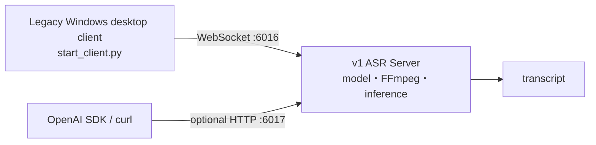

# CapsWriter-Offline fork v1 — Legacy Server + Desktop Client

> **v1 is an isolated, best-effort maintenance line.** Its primary deliverable
> is the Linux/headless ASR server. The same source retains compatibility with
> the upstream 2.5-alpha-era Windows desktop client.
>
> [繁體中文](readme.md) · English

[](LICENSE)
[](docs/en/maintenance.md)
[](docs/docker-server.md)

## First understand the v1 server/client split



| Component | v1 content | Release status |
|---|---|---|
| **Server** | Linux bare-metal/Docker, WebSocket `6016`, optional transcription-only HTTP `6017`, model bootstrap, GPU preference/CPU fallback | Primary maintained v1 path; GitHub Releases provide source for local builds |
| **Desktop client** | Upstream-era `start_client.py`: Windows GUI, tray, hotkeys, microphone, clipboard/text injection | Source compatibility only; no v1 Windows EXE unless a release explicitly attaches a real-Windows-qualified artifact |
| **External API caller** | Compatible SDK/curl code may use the documented `whisper-1` transcription subset | API interface, not a bundled client application |

**v1 does not contain the v2 Web Console, no-GUI CLI, Textual TUI, or universal
Windows package.** Use v2 when you need those surfaces.

## Release and image boundary

- v1 GitHub Releases are **source-only pre-releases**.
- Source archives include both legacy server/API/container code and the
  compatibility-preserved Windows desktop client source.
- No v1 container image or Windows executable is currently published.
- `ghcr.io/df-wu/capswriter-offline-server:latest` belongs to **v2** and must
  not be used for v1.
- v1 Compose builds `capswriter-offline-v1-local:source` from the current tree.

## Quick start: v1 Linux server

Prerequisites: Linux, Docker Engine, the Compose plugin, and model storage.
NVIDIA GPU support is optional; CPU fallback is available.

```bash
cp .env.example .env
cp hot-server.example.txt hot-server.txt
docker compose build --pull capswriter-server
docker compose up -d capswriter-server
docker compose ps
docker compose logs -f capswriter-server
```

Default WebSocket endpoint:

```text
ws://127.0.0.1:6016
```

See [v1 Docker server](docs/docker-server.md) for models, GPU/CPU selection,
volumes, and troubleshooting.

## Optional OpenAI-compatible HTTP API

The HTTP API shares the recognizer with the WebSocket server and is disabled by
default. It implements only the documented file-transcription subset, not
translation or the complete OpenAI Audio API.

Enable it in `.env` with a token:

```dotenv
CAPSWRITER_HTTP_API_ENABLE=true
CAPSWRITER_HTTP_API_BIND=0.0.0.0
CAPSWRITER_HTTP_API_HOST_BIND=127.0.0.1
CAPSWRITER_HTTP_API_PORT=6017
CAPSWRITER_HTTP_API_KEY=replace-with-a-long-random-token
```

Recreate the server after changing `.env`. Compose passes these settings into
the container and publishes port `6017` on host loopback by default. Keep
`CAPSWRITER_HTTP_API_HOST_BIND=127.0.0.1` unless a trusted reverse proxy with
authentication and TLS requires a wider host bind. Compatible callers may
point their base URL at `http://127.0.0.1:6017/v1`; unsupported fields may be
rejected.

See the [English HTTP API guide](docs/en/http-api.md) for the exact contract,
security limits, and SDK/curl examples.

## Legacy Windows desktop client

v1 source retains the original desktop flow:

```text
start_server.py  --WebSocket :6016-->  start_client.py
```

The desktop client owns tray, hotkeys, microphone, clipboard, and text
injection. The server loads the model and performs inference. This is not the
v2 universal package, and the current v1 release does not include an EXE.

A self-built Windows artifact still needs real-host launch/exit, tray, hotkey,
microphone, clipboard, FFmpeg, model, known-audio, and child-cleanup validation.

## Support scope

| Path | Status | Automated evidence | Remaining real-host evidence |
|---|---|---|---|
| Linux Docker server | Primary legacy server path | Ubuntu tests, Compose config, entrypoint shell, protocol/API units | Disposable image build, model load, Mandarin/English known audio, GPU/CPU host |
| Linux bare-metal server | Best effort | Python 3.10/3.12 server tests | FFmpeg, native libraries, model, supervision |
| Windows desktop source | Compatibility-preserved | Windows Python 3.10/3.12 syntax/protocol tests | Tray, hotkeys, microphone, clipboard, PyInstaller artifact |
| Optional HTTP API | Legacy compatibility | Auth, upload bound, format, routing tests | Live authenticated model-backed transcription |
| macOS | Not release-qualified | No complete gate | No project-level support claim |

Passing CI does not certify model quality, a GPU backend, audio hardware, or a
Windows desktop release.

## Maintenance and branch rules

- Development branch: `maintenance/v1`
- Standing comparison PR base: `archive/v1-legacy`
- Never merge v1 into `master` or bulk-backport v2 into v1.
- Only critical security, compatibility, model-asset, and contract fixes belong
  here.
- v1 tags use `fork-v1.<minor>.<patch>`; pre-releases may add `-rc.<n>`.

Policies:

- [English maintenance policy](docs/en/maintenance.md)
- [繁體中文維護政策](docs/zh-TW/maintenance.md)

## Documentation

| Document | Covers |
|---|---|
| [v1 Docker server](docs/docker-server.md) | Local source build, models, GPU/CPU, volumes, operations |
| [HTTP API](docs/en/http-api.md) | Transcription subset, auth, limits, SDK/curl |
| [v1 maintenance policy](docs/en/maintenance.md) | Branches, support, qualification, residual risks |
| [v1 release notes](docs/en/release-notes.md) | RC deliverables, server/client boundary, remaining qualification |
| [Upstream release history](https://github.com/HaujetZhao/CapsWriter-Offline/releases) | Upstream-era product history |

## Upstream and license

This line derives from the 2.5-alpha-era desktop/recognition code in
[HaujetZhao/CapsWriter-Offline](https://github.com/HaujetZhao/CapsWriter-Offline)
and adds the fork's maintained Linux server, Docker, and HTTP API changes. New
feature development belongs to fork v2.

License: [MIT](LICENSE).
