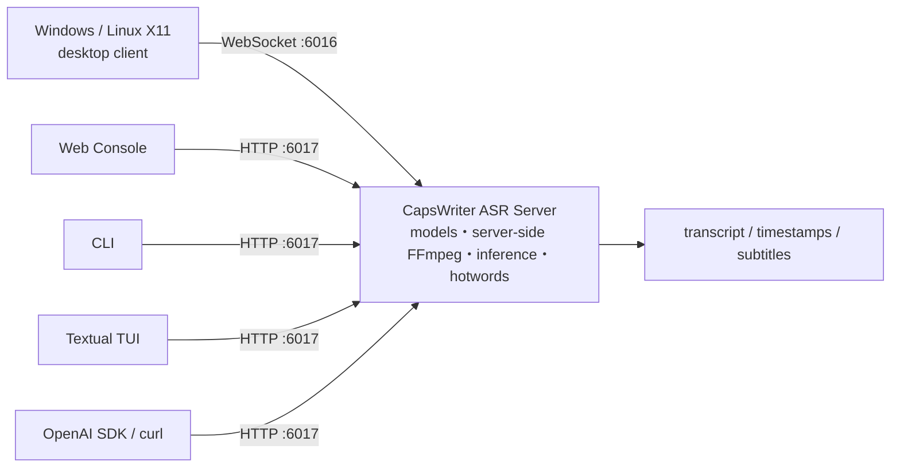

# CapsWriter-Offline — Local ASR Server + Multiple Clients

> CapsWriter performs speech recognition locally. **The server owns models and
> inference; clients own audio input, interaction, and result presentation.**
> Choose where the server runs, then choose one or more clients.
>
> English · [繁體中文](readme.md)

[](LICENSE)
[](docs/en/desktop-portability.md)
[](docker-compose.yml)
[](docs/en/openai-api.md)

This fork retains the upstream CapsWriter v2 offline recognition models,
Windows desktop workflow, and WebSocket protocol. It adds a Linux container,
an opt-in OpenAI-compatible HTTP API, Web/CLI/TUI clients, a Windows production
package, and cross-platform release gates.

## First understand: server and client are different roles



| Component | What it owns | What it does not own |
|---|---|---|
| **Server** | Loads ASR models, decodes audio, applies hotwords, schedules inference, produces transcripts, and reports health/readiness | It does not provide the browser/terminal UI or operate a user's clipboard and global shortcuts |
| **Client** | Records or selects audio, sends it, and displays/saves results; the desktop client also owns tray, hotkeys, and text injection | It does not load the recognition model or run ASR inference itself |

The two server interfaces serve different clients:

| Interface | Default | Consumers |
|---|---:|---|
| WebSocket `ws://127.0.0.1:6016` | On | Upstream Windows/Linux X11 desktop client |
| OpenAI-compatible HTTP `http://127.0.0.1:6017` | **Off; explicit opt-in** | Web Console, CLI, TUI, OpenAI SDK, curl |
| Web Console `http://127.0.0.1:8080` | Optional | UI only; inference still runs on the server behind `:6017` |

> **Common misunderstanding:** Web, CLI, and TUI are not separate recognition
> engines. They require a CapsWriter server with the HTTP API enabled. The
> original desktop client uses WebSocket directly and normally needs no HTTP API.

Read [Server and client roles](docs/en/server-and-clients.md) for the complete
component, protocol, and deployment map.

## Step 1: choose a server

| Server path | Best for | Entry point | Support boundary |
|---|---|---|---|
| **Windows native/package** | Desktop dictation on one Windows PC, or a Windows ASR host | `start_server.exe` or `python start_server_universal.py` | Windows CI builds and self-checks both production EXEs; real audio, tray, shortcut, model, and hardware behavior still requires target-host validation |
| **Linux Docker (recommended headless path)** | NAS, workstation, server, or shared LAN ASR | `docker compose up -d capswriter-server` | The release gate targets `linux/amd64`; CPU works, while GPU/iGPU paths require the documented override and real-host evidence |
| **Windows/Linux source** | Development, debugging, and custom integration | `python start_server_universal.py` | You own server dependencies, models, and FFmpeg; Linux desktop hotkeys require X11 |

See the [deployment guide](docs/en/deployment.md) for complete server setup and
operations.

## Step 2: choose a client

| Client | Connection | Primary use | Bundled ASR model? |
|---|---|---|---:|
| **Windows/Linux X11 desktop client** | WebSocket `:6016` | Tray, global hotkeys, microphone, file transcription, clipboard/text injection | No |
| **Web Console** | HTTP `:6017` | Browser recording, upload, five formats, downloads, browser-local TTS | No |
| **No-GUI CLI** | HTTP `:6017` | Scripts, SSH, batch work, atomic output, local OS TTS | No |
| **Textual TUI** | HTTP `:6017` | Keyboard-first diagnostics, file transcription, optional microphone, save | No |
| **OpenAI SDK/curl** | HTTP `:6017/v1` | Point an existing integration at the local transcription subset | No |


## Quick start A: Windows desktop

The Windows package contains two programs with different roles:

1. `start_server.exe` loads the model and provides recognition.
2. `start_client.exe` provides the tray, hotkeys, recording, and text-input UX.

For a packaged install, choose a v2 entry on
[GitHub Releases](https://github.com/DF-wu/CapsWriter-Offline-Container/releases)
only when that entry includes a Windows ZIP. If none is listed yet, follow the
source build instructions in the portability guide. Extract the complete
archive, then complete the
[Windows package prerequisites](docs/en/desktop-portability.md#prepare-a-downloaded-windows-package)
before starting a local Server. The tested program ZIP intentionally has an
empty `models/` directory and does not bundle the GGUF runtime DLLs or FFmpeg.
The guide pins the default Qwen model and llama.cpp downloads by SHA-256 and
shows their exact destinations. A Client that connects to another Server does
not need a local model; desktop file/media transcription still needs FFmpeg.

After the prerequisites are present, start `start_server.exe`, wait for the
model to load, and then start `start_client.exe`. Do not copy only one EXE:
configuration, source trees, and runtime files must retain their
release-relative paths.

See [desktop portability](docs/en/desktop-portability.md) for build instructions,
DirectML, X11, and real-host qualification.

## Quick start B: Linux Docker server + HTTP client

### 1. Start the server

Prerequisites: `linux/amd64`, Docker Engine, the Compose plugin, and sufficient
model/image storage. GPU support is optional.

```bash
git clone https://github.com/DF-wu/CapsWriter-Offline-Container.git
cd CapsWriter-Offline-Container
cp .env.example .env
cp hot-server.example.txt hot-server.txt
docker compose up -d capswriter-server
docker compose ps
```

WebSocket `:6016` is now available to the desktop client. Continue only if you
want Web, CLI, TUI, or OpenAI SDK access.

### 2. Enable the HTTP API

Set these values in `.env`:

```dotenv
CAPSWRITER_HTTP_API_ENABLE=true
CAPSWRITER_HTTP_API_KEY=replace-with-a-long-random-token
CAPSWRITER_HTTP_API_PUBLISH_HOST=127.0.0.1
CAPSWRITER_HTTP_API_PORT=6017
CAPSWRITER_HTTP_API_CORS_ORIGINS=http://127.0.0.1:8080,http://localhost:8080,http://127.0.0.1:5173,http://localhost:5173
```

The `8080` origins are for the packaged Web Console below; the `5173` origins
are for Vite development. Remove origins you do not use. CLI, TUI, SDK, and
curl are not governed by browser CORS.

Then uncomment the second port mapping in
[`docker-compose.yml`](docker-compose.yml):

```yaml
ports:
  - "127.0.0.1:6016:6016"
  - "127.0.0.1:6017:6017"
```

Recreate the service and require **readiness**. `/health` only proves the
process is alive; `/ready` proves the model and required runtime can accept
audio.

```bash
docker compose up -d --force-recreate capswriter-server
curl http://127.0.0.1:6017/health
curl http://127.0.0.1:6017/ready
```

Keep authentication for any non-loopback exposure and use a TLS reverse proxy
or private overlay network. See [support and security](docs/en/support-security.md).

### 3. Start one client

Web Console:

```bash
CAPSWRITER_WEB_API_BASE=http://127.0.0.1:6017 \
  docker compose -f docker-compose.web.yml up -d --build capswriter-web
```

Open `http://127.0.0.1:8080`, confirm the API root is
`http://127.0.0.1:6017`, and enter the same server token in the masked API-key
field. The Web container serves static UI; the browser calls the server itself.

CLI:

```bash
export CAPSWRITER_API_BASE=http://127.0.0.1:6017
export CAPSWRITER_HTTP_API_KEY=replace-with-a-long-random-token
python client/cli/capswriter_cli.py ready
python client/cli/capswriter_cli.py transcribe meeting.wav --format text
```

TUI:

```bash
python3.12 -m venv .venv-tui
.venv-tui/bin/python -m pip install \
  --require-hashes --only-binary=:all: \
  --requirement requirements-tui.lock
.venv-tui/bin/python -m client.tui --base-url http://127.0.0.1:6017
```

Paste the server token into the TUI's masked **API key (memory only)** field;
the TUI intentionally has no command-line key argument.

Web development mode must use the locked dependency tree:

```bash
cd client/web
npm ci --no-audit --no-fund
npm run dev
```

Open `http://127.0.0.1:5173`, use API root `http://127.0.0.1:6017`, and enter
the Server token. If you add or change an origin, recreate the Server so its
CORS configuration takes effect.

## Server capabilities

- Local ASR models and server-side FFmpeg decoding; no cloud inference service
  is required.
- Model bootstrap, hotwords, persistence, GPU preference, CPU fallback, and
  readiness reporting.
- The original WebSocket protocol plus an opt-in OpenAI-compatible `whisper-1`
  file-transcription subset.
- HTTP responses in `text`, `json`, `verbose_json`, `srt`, and `vtt`.
- Upload, decoded-audio, queue, concurrency, deadline, and response-size bounds.
- Authentication, a CORS allowlist, privacy-safe logging, and OpenAI-style
  error envelopes.

The first container start may download model and runtime assets. Inference is
local after those assets are present.

## Client capabilities

- **Desktop:** the complete local dictation UX; native on Windows. Linux global
  hotkeys support X11 only, not Wayland/headless sessions.
- **Web:** no Python client install; microphone use requires localhost or an
  HTTPS secure context.
- **CLI:** best for automation, SSH, batch work, and shell pipelines.
- **TUI:** interactive terminal workflow; file mode is core, while microphone
  use needs the optional native `sounddevice`/PortAudio stack.
- **SDK:** only the documented transcription subset is compatible. Translation,
  streaming, diarization, and the complete OpenAI Audio API are not implemented.

## Documentation map

### Read first

| Document | Question answered |
|---|---|
| [Server and client roles](docs/en/server-and-clients.md) | Which component performs inference, and which port does each client use? |
| [Getting started](docs/en/getting-started.md) | Should I choose Windows desktop, Linux X11, or Docker? |
| [Documentation home](docs/en/README.md) | Where are all user, operator, and contributor guides? |

### Server/API

| Document | Covers |
|---|---|
| [Deployment](docs/en/deployment.md) | Docker, Windows/source server, network, persistence, upgrade, rollback |
| [OpenAI-compatible API](docs/en/openai-api.md) | HTTP/SDK contract, authentication, limits, errors |
| [Support and security](docs/en/support-security.md) | Platform matrix, secrets, privacy, supply chain |

### Clients

| Document | Covers |
|---|---|
| [Desktop portability](docs/en/desktop-portability.md) | Windows package, Linux X11, Wayland/headless boundary |
| [Web Console](docs/en/web-console.md) | Browser deployment, CORS, secure context |
| [CLI](docs/en/cli-client.md) | Scripts, batch, zipapp, output, TTS |
| [TUI](docs/en/tui.md) | Installation, keyboard UX, recording, save, diagnostics |

### Operations/release

| Document | Covers |
|---|---|
| [Troubleshooting](docs/en/troubleshooting.md) | Desktop, container, API, Web, CLI, TUI diagnostic order |
| [Release notes](docs/en/release-notes.md) | Changes, migration, limitations, release evidence |
| [v1/v2 policy](docs/en/versioning.md) | Maintenance tracks and tag rules |
| [Verification](docs/verification.md) | CI, package, image, cleanup, and manual evidence |

## Support and release evidence

- Portable source and TUI checks run on Ubuntu 24.04/Windows 2022 with Python
  3.10 and 3.12.
- The Windows production job hash-installs dependencies, builds the PyInstaller
  package, moves the ZIP outside the checkout, extracts it, rejects reparse
  points, and self-checks both `start_server.exe` and `start_client.exe`.
- Server/Web images use immutable commit tags with SBOM/provenance; `latest` is
  promoted only to the current gated `master` tip.
- Real models, known audio, microphones, tray behavior, X11, GPU/DirectML, and
  target hardware still require validation before claiming those release
  capabilities.

Fork v2 is active. Fork v1 is an isolated best-effort security/compatibility
maintenance line; never merge either generation wholesale into the other. See
the [version policy](docs/en/versioning.md).

## Upstream and license

This fork builds on
[HaujetZhao/CapsWriter-Offline](https://github.com/HaujetZhao/CapsWriter-Offline),
retaining its models, inference algorithms, and desktop product work. The fork
adds deployment, portability, API, clients, security boundaries, and release
automation.

License: [MIT](LICENSE).
