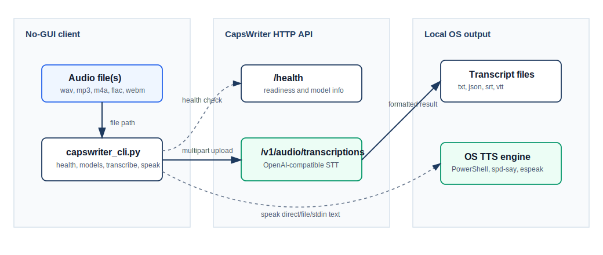

# No-GUI CLI Client

The no-GUI client lives in [`client/cli`](../client/cli). It is a standard-library Python client for the OpenAI-compatible CapsWriter HTTP API and local OS text-to-speech. It is intended for scripts, SSH sessions, CI smoke checks, batch transcription, and users who do not want the desktop GUI or browser console.



## Capabilities

| Area | Support |
|---|---|
| Server checks | `health`, `ready`, `models` |
| STT | `transcribe` one or more audio files through `POST /v1/audio/transcriptions` |
| Formats | `text`, `json`, `verbose_json`, `srt`, `vtt` |
| Batch output | stdout, one explicit `--output`, or generated files in `--output-dir` |
| TTS | `speak` direct text, UTF-8 files, or stdin through local OS engines |
| Packaging | single-file Python zipapp (`capswriter-cli.pyz`) |
| Isolation | No third-party Python dependency; tests use an in-process mock HTTP server |

## Requirements

- Python 3.10+ on Linux or Windows.
- A running CapsWriter HTTP API for real STT.
- Optional local TTS engine:
  - Windows: PowerShell `System.Speech` on normal desktop installs.
  - Linux: `spd-say`, `espeak-ng`, or `espeak`.

The CLI does not install or require global packages.

## Packaged CLI

Build a single-file zipapp:

```bash
python client/cli/scripts/build_zipapp.py
python client/cli/dist/capswriter-cli.pyz --help
```

The artifact is written to `client/cli/dist/capswriter-cli.pyz`. It contains only the standard-library CLI source and can be copied to Linux or Windows machines with Python 3.10+:

```bash
python capswriter-cli.pyz health --base-url http://127.0.0.1:6017
python capswriter-cli.pyz ready --base-url http://127.0.0.1:6017
python capswriter-cli.pyz transcribe meeting.wav --format text
```

`client/cli/dist` is ignored by Git and removed by the cleanup scripts.

## Server setup

Enable the HTTP API:

```bash
CAPSWRITER_HTTP_API_ENABLE=true
CAPSWRITER_HTTP_API_BIND=0.0.0.0
CAPSWRITER_HTTP_API_PORT=6017
CAPSWRITER_HTTP_API_KEY=sk-local-dev
```

Then verify:

```bash
python client/cli/capswriter_cli.py --help
python client/cli/capswriter_cli.py health --base-url http://127.0.0.1:6017 --key sk-local-dev
python client/cli/capswriter_cli.py ready --base-url http://127.0.0.1:6017 --key sk-local-dev
python client/cli/capswriter_cli.py models --base-url http://127.0.0.1:6017 --key sk-local-dev
```

For production shells and process supervisors, prefer a key file so the token is not placed directly in command history or process arguments:

```bash
install -m 600 -D /dev/null /run/secrets/capswriter-http.key
printf '%s\n' 'sk-local-dev' > /run/secrets/capswriter-http.key
python client/cli/capswriter_cli.py ready \
  --base-url http://127.0.0.1:6017 \
  --key-file /run/secrets/capswriter-http.key
```

You can also use environment variables:

```bash
export CAPSWRITER_API_BASE=http://127.0.0.1:6017
export CAPSWRITER_HTTP_API_KEY=sk-local-dev
python client/cli/capswriter_cli.py health
python client/cli/capswriter_cli.py ready
```

On Windows PowerShell:

```powershell
$env:CAPSWRITER_API_BASE = "http://127.0.0.1:6017"
$env:CAPSWRITER_HTTP_API_KEY = "sk-local-dev"
python client\cli\capswriter_cli.py health
python client\cli\capswriter_cli.py ready
```

For the CLI, use `CAPSWRITER_HTTP_API_KEY_FILE` instead of `CAPSWRITER_HTTP_API_KEY` when a service manager or secret mount can provide a UTF-8 file containing the client token. The file must contain a non-empty token after whitespace is trimmed. The server also accepts the same variable for its Bearer token file; explicit `CAPSWRITER_HTTP_API_KEY` takes precedence on both sides.

## Server Diagnostics

`health` confirms that the HTTP process responds. `ready` is stricter: it calls `/ready` and prints deployment diagnostics such as whether the HTTP task router is bound, whether `ffmpeg` is available, and which operational limits are active. Use `ready` before routing production traffic or when a container health check passes but transcription still fails.

## Transcribe

Print plain text:

```bash
python client/cli/capswriter_cli.py transcribe meeting.wav --format text
```

Write one output file:

```bash
python client/cli/capswriter_cli.py transcribe meeting.wav \
  --format verbose_json \
  --output meeting.transcript.json
```

`json` and `verbose_json` outputs are written as valid JSON, not plain transcript text.

Batch mode:

```bash
python client/cli/capswriter_cli.py transcribe audio/*.wav \
  --format srt \
  --output-dir transcripts/
```

`--output-dir` derives filenames from each audio stem and response format. If two inputs would generate the same target path, the CLI fails before sending any HTTP request so a batch run cannot silently overwrite an earlier transcript.

Language and prompt hints are passed to the HTTP API for compatibility:

```bash
python client/cli/capswriter_cli.py transcribe meeting.wav \
  --language zh \
  --prompt "會議術語：CapsWriter, Qwen, FunASR"
```

The server normalizes common aliases such as `zh`, `zh_CN`, `en`, `ja`, `ko`, and `yue` to the internal language names used by the ASR engines. Prompt text is passed as recognizer context after newline normalization and a 2048-character cap.

## Speak

Speak direct text:

```bash
python client/cli/capswriter_cli.py speak "CapsWriter transcription completed."
```

Read text from a UTF-8 file:

```bash
python client/cli/capswriter_cli.py speak transcript.txt --file
```

Read text from stdin, which is useful for shell pipelines:

```bash
python client/cli/capswriter_cli.py transcribe meeting.wav --format text \
  | python client/cli/capswriter_cli.py speak --stdin
```

Preview which local command would be used:

```bash
python client/cli/capswriter_cli.py speak "test" --dry-run
```

`--file` and `--stdin` are mutually exclusive. `--stdin` also rejects a positional text argument so scripts do not accidentally ignore input.

The `speak` command does not call the CapsWriter server and does not send text to a cloud service. It shells out to the local operating system TTS engine.

## Exit codes

| Code | Meaning |
|---|---|
| `0` | Success |
| `1` | HTTP failure, unsupported format, missing file/text input, invalid TTS input combination, or unavailable local TTS engine |

When the server returns OpenAI-style `{"error": ...}` JSON, the CLI prints the contained `error.message` instead of dumping raw JSON. Legacy FastAPI `{"detail": ...}` payloads are also normalized for compatibility with older servers. If a proxy or old server returns a non-JSON HTTP error body, the CLI prints the HTTP status with a bounded one-line body preview. If a health/readiness/models call or JSON transcription response is malformed, the error includes the HTTP status and endpoint.

`--timeout` defaults to `600` seconds to match `CAPSWRITER_HTTP_API_TASK_TIMEOUT`. It must be a positive number; invalid values are rejected by argument parsing before any HTTP request is attempted.

## Verification

Run the isolated verification script:

```bash
python client/cli/scripts/verify.py
```

It performs:

1. `python -m compileall client/cli`
2. `python -m unittest discover -s client/cli/tests -v`
3. `python client/cli/scripts/build_zipapp.py`
4. `python client/cli/dist/capswriter-cli.pyz --help`
5. packaged `speak --stdin --dry-run` smoke with stdin input
6. `python client/cli/scripts/clean.py`

The tests start an in-process mock HTTP API, so they do not need a real model server. The clean step removes `__pycache__` and `.pyc` files even when a previous step fails.

Manual cleanup:

```bash
python client/cli/scripts/clean.py
```

## Implementation notes

- Multipart upload is implemented with `urllib.request` and a generated boundary; local filenames are escaped before writing the `Content-Disposition` header.
- `--base-url` accepts either `http://host:6017` or `http://host:6017/v1`.
- `--key-file` and `CAPSWRITER_HTTP_API_KEY_FILE` read a non-empty UTF-8 Bearer token file; explicit `--key` still takes precedence for one-off local diagnostics.
- `--timeout` defaults to the server task timeout (`600` seconds), is validated as a positive float, and is then passed consistently to health/readiness/models and transcription requests.
- `--output-dir` maps output extensions by response format (`.txt`, `.json`, `.srt`, `.vtt`) and rejects duplicate generated target paths before transcription starts.
- `--language` and `--prompt` are sent to the HTTP API; backend support still depends on the selected model.
- HTTP errors normalize OpenAI-style `error.message`, legacy `detail` payloads, non-JSON HTTP error bodies, and invalid JSON responses from expected JSON endpoints.
- `speak` accepts direct text, a UTF-8 file via `--file`, or standard input via `--stdin`; stdin mode is intended for transcription-to-speech shell pipelines.
- Windows TTS uses PowerShell `System.Speech`.
- Linux TTS prefers `spd-say`, then `espeak-ng`, then `espeak`.
