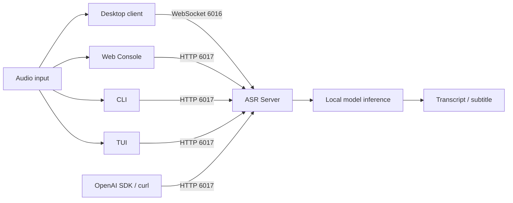

# Server and client roles

> [Documentation home](README.md) · [繁體中文](../zh-TW/server-and-clients.md) · [Getting started](getting-started.md)

CapsWriter is a client/server application. The **server** runs speech
recognition. A **client** collects audio and presents the result. Installing a
client does not install or duplicate the recognition model.

## The one rule to remember

1. Start one server for the model/hardware profile you want. Isolate ports and
   writable storage before intentionally running another.
2. Wait until that server is ready.
3. Connect one or more compatible clients within the configured connection,
   queue, and concurrency limits.



## What the server owns

Only the server loads the recognition model and runs ASR inference. On the
server side, it also:

- loads Qwen ASR, Fun-ASR, SenseVoice, or another configured recognition model;
- downloads/prepares model and native runtime assets when configured to do so;
- invokes FFmpeg to decode and normalize submitted audio for inference;
- applies server hotwords and recognition settings;
- schedules the worker, bounds requests/queues, and returns transcripts;
- reports liveness and model/runtime readiness;
- exposes WebSocket and, when explicitly enabled, HTTP interfaces.

The desktop client can also launch its own FFmpeg process to save local
recordings or prepare file-transcription audio before sending it over
WebSocket. That client-side media preparation is not ASR inference and does not
load a recognition model.

### Server choices

| Server | Where it runs | Typical entry point | Intended use |
|---|---|---|---|
| Windows package | Windows x86-64 | `start_server.exe` | Local desktop dictation or a Windows ASR host |
| Native source | Windows or Linux | `python start_server_universal.py` | Development, debugging, custom installs, Linux X11 desktop |
| Linux container | Linux `amd64` | `docker compose up -d capswriter-server` | Headless, NAS, workstation, or shared service |

Do not run multiple servers against the same ports or writable model/log paths
unless you intentionally isolate their configuration and storage.

## Server interfaces

| Interface | Address | Default | Used by |
|---|---|---:|---|
| WebSocket | `ws://127.0.0.1:6016` | Enabled | Original desktop client |
| OpenAI-compatible HTTP | `http://127.0.0.1:6017` | Disabled | Web, CLI, TUI, SDK, curl |
| HTTP liveness | `GET /health` | With HTTP | Process-level health only |
| HTTP readiness | `GET /ready` | With HTTP | Model, router, FFmpeg, and limit readiness |

`/health` is not a substitute for `/ready`. A process can be alive while its
model is still downloading or loading.

## What each client owns

Clients never run the server's ASR model. Their local behavior differs:

| Client | Input and UX | Connection | Local-only features | Not included |
|---|---|---|---|---|
| Windows/Linux X11 desktop | Microphone, file transcription, tray, global hotkeys | WebSocket `6016` | Clipboard/text injection and local FFmpeg media preparation | No ASR model or inference; HTTP API is not required for its normal path |
| Web Console | Browser recording or file upload | HTTP `6017` | Browser history/downloads and browser/OS TTS | No model, FFmpeg worker, tray, or global hotkey |
| CLI | File or batch paths | HTTP `6017` | Atomic files and optional OS TTS | No microphone, tray, or global hotkey |
| Textual TUI | File input and optional native microphone | HTTP `6017` | Keyboard workflow and atomic save | No TTS, tray, or global hotkey |
| OpenAI SDK/curl | File upload | HTTP `6017/v1` | Integration-specific handling | No bundled user interface |

TTS in Web/CLI is client-local. It does not mean the ASR server exposes a TTS
endpoint.

## Supported combinations

### Personal Windows desktop

```text
start_client.exe  --WebSocket :6016-->  start_server.exe
```

Start the server first, wait for model load, then start the desktop client. The
HTTP API is optional and can remain disabled.

### Linux X11 desktop

```text
start_client.py  --WebSocket :6016-->  start_server_universal.py
```

Both processes run in the logged-in X11 environment. Wayland/headless global
hotkeys are unsupported; use a file, Web, CLI, or TUI client instead.

### Headless server with browser or terminal clients

```text
Web / CLI / TUI / SDK  --HTTP :6017-->  Docker server
```

Enable the HTTP API and authentication, publish port `6017`, then connect one
or more clients. Web Console port `8080` serves static UI only; the browser
still calls the server on `6017`.

### Shared or remote server

Keep the server behind a private network or maintained TLS reverse proxy. Use a
Bearer key/key file, an explicit CORS allowlist for Web, and only the required
published ports. WebSocket `6016` is not an authenticated public API.

## Correct startup order

1. Choose and configure the server model/hardware path.
2. Start the server.
3. For desktop, confirm the WebSocket listener on `6016` and start the desktop
   client.
4. For Web/CLI/TUI/SDK, enable HTTP, configure authentication, publish `6017`,
   and require both `/health` and `/ready`.
5. Send one small known-audio file and verify its expected content.
6. Add other clients only after the first path succeeds.

## Common mistakes

- **Starting only a client:** there is no local model behind it; start a server.
- **Pointing Web/CLI/TUI at port 6016:** those clients require HTTP port 6017.
- **Enabling HTTP for the desktop client:** unnecessary unless another HTTP
  consumer needs it.
- **Treating the Web container as the ASR server:** it serves static files only.
- **Checking only `/health`:** use `/ready` before uploading audio.
- **Assuming TTS is a server feature:** Web/CLI TTS uses local browser/OS voices.
- **Copying one Windows EXE out of the package:** keep both EXEs, models,
  configuration, and runtime libraries in their release layout.

## Continue by component

### Server and API

- [Deployment](deployment.md)
- [OpenAI-compatible API](openai-api.md)
- [Support and security](support-security.md)
- [Troubleshooting](troubleshooting.md)

### Clients

- [Desktop portability](desktop-portability.md)
- [Web Console](web-console.md)
- [No-GUI CLI](cli-client.md)
- [Textual TUI](tui.md)
