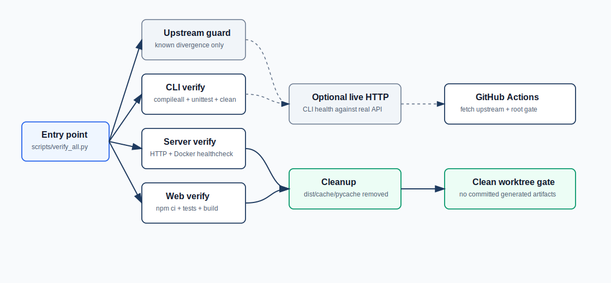

# Verification And Cleanup

This fork now has a repository-level verification gate for production readiness work. It is intentionally composed from smaller isolated checks so server, no-GUI CLI, and Web Console behavior can be tested without installing global dependencies or leaving generated files behind.



## One-command local gate

```bash
python scripts/verify_all.py
```

The command runs:

| Step | Command | Coverage |
|---|---|---|
| CLI | `python client/cli/scripts/verify.py` | CLI syntax, health/readiness/models calls, streamed multipart upload including filename escaping and early error responses, mock HTTP transcription, HTTP and invalid JSON diagnostics, output files, Linux/Windows TTS command selection, zipapp packaging |
| Server | `python -m compileall fork_server docker/server check_http_api.py start_server_docker.py` + HTTP and Docker server unit tests | HTTP sidecar, strict Bearer header parsing, Docker entrypoint/healthcheck syntax, readiness-gated container healthcheck, privacy-preserving transcript logging, SRT/VTT timestamp formatting, bounded ffmpeg decode diagnostics, model downloader diagnostics, dependency-light request limit and runtime config tests |
| Verifier/diagnostic | `python -m unittest discover -s scripts/tests -v` | Root gate helper behavior, including redaction of live HTTP API keys from shared logs, plus diagnostic streamed multipart upload escaping and real HTTP body delivery, configurable live transcription timeout, HTTP API dependency guards, `/health` 401 API-key guidance, cleanup traversal pruning, and source guard for configured ffmpeg decode timeout |
| Web | `npm ci --no-audit --no-fund` then `npm run verify` in `client/web` | React/Vite tests, bounded Web API and invalid JSON diagnostics, recording resource cleanup, deferred export URL cleanup, TTS voice handler cleanup, clipboard failure handling, best-effort localStorage persistence, malformed settings/history recovery, runtime `/config.js` escaping, TypeScript, production build, web clean script |
| Optional Web browser smoke | temporary mock API + Vite + `agent-browser` | Real browser can check server health, upload audio, and transcribe through the UI |
| Optional Web image | `docker build` + temporary `docker run` smoke check | Production Nginx/static image can build and serve `/health` + runtime `/config.js` |
| Optional live HTTP | `client/cli/capswriter_cli.py health` + optional readiness and known-audio transcription | Real server health, deployment readiness, and model-backed STT when configured |
| Cleanup | `python scripts/clean.py` | Removes build/cache/pycache artifacts |

The web dependency install is scoped to `client/web/node_modules`. Nothing is installed globally.

## Options

Skip web verification:

```bash
python scripts/verify_all.py --skip-web
```

Use existing `client/web/node_modules` and fail if it is missing:

```bash
python scripts/verify_all.py --no-web-install
```

Add a live server health check:

```bash
python scripts/verify_all.py --http-base-url http://127.0.0.1:6017
```

Require the live server readiness endpoint as well:

```bash
python scripts/verify_all.py \
  --http-base-url http://127.0.0.1:6017 \
  --http-require-ready
```

Add a model-backed transcription smoke check with a known audio sample:

```bash
python scripts/verify_all.py \
  --http-base-url http://127.0.0.1:6017 \
  --http-audio /path/to/known-speech.wav \
  --http-expect "expected transcript text"
```

If `--http-expect` is omitted, the gate only requires a non-empty transcript. Keep release-candidate sample audio outside Git unless it is small, redistributable, and intentionally part of the repository.

Build the Web Console production image as part of the gate:

```bash
python scripts/verify_all.py --docker-build-web
```

This uses the temporary image tag `capswriter-web-console:verify`, starts a temporary container named `capswriter-web-console-verify`, checks `/health` and `/config.js`, then removes both during cleanup.

Run the browser-level Web Console smoke:

```bash
python scripts/verify_all.py --web-browser-smoke
```

This requires `npx agent-browser` to be available. It starts temporary local services on free ports and removes browser/test artifacts through the normal cleanup path.

With auth:

```bash
python scripts/verify_all.py \
  --http-base-url http://127.0.0.1:6017 \
  --http-key sk-local-dev
```

Environment alternative:

```bash
CAPSWRITER_VERIFY_HTTP_BASE=http://127.0.0.1:6017 \
CAPSWRITER_VERIFY_HTTP_REQUIRE_READY=true \
CAPSWRITER_VERIFY_HTTP_AUDIO=/path/to/known-speech.wav \
CAPSWRITER_VERIFY_HTTP_EXPECT="expected transcript text" \
CAPSWRITER_HTTP_API_KEY=sk-local-dev \
python scripts/verify_all.py
```

## Cleanup

```bash
python scripts/clean.py
```

Cleanup removes:

| Path pattern | Reason |
|---|---|
| `__pycache__`, `*.pyc` | Python verification output |
| `client/cli/dist` | Packaged no-GUI CLI zipapp output |
| `client/web/dist` | Vite production build output |
| `client/web/.vite`, `client/web/node_modules/.vite` | Vite cache |
| `coverage`, `htmlcov`, `playwright-report`, `test-results` | Test/report output |
| `.drawio-tmp` | Diagram sidecars generated during local authoring |
| TypeScript emitted config artifacts | Guard against accidental `tsc -b` output |

`client/web/node_modules` and `models` are not removed by default. They are isolated dependency/model directories and are ignored by Git; removing or walking them on every verification would force unnecessary downloads or slow cleanup on large model installs. Delete them manually if a completely fresh dependency or model install is required.

## CI

[`ci.yml`](../.github/workflows/ci.yml) runs on push, pull request, and manual dispatch:

```text
checkout -> setup Python 3.12 -> setup Node 24 -> python scripts/verify_all.py
```

The publish workflows remain separate. CI verifies source, tests, and local builds; [`publish-server-image.yml`](../.github/workflows/publish-server-image.yml) builds the server image and [`publish-web-image.yml`](../.github/workflows/publish-web-image.yml) builds the static Web Console image when maintainers choose to publish.

## Evidence expected before release

For a release candidate, keep these artifacts or logs:

| Requirement | Evidence |
|---|---|
| Upstream merged | Git merge commit in branch history |
| Server syntax, Docker server helpers, and HTTP sidecar valid | `python scripts/verify_all.py` logs |
| Shared gate logs do not expose API keys | `scripts/tests` output from inside the root gate |
| Web Console build valid | `npm run verify` logs from inside the root gate |
| Web Console browser workflow valid | `--web-browser-smoke` gate output |
| CLI valid | `client/cli/scripts/verify.py` logs from inside the root gate |
| Real HTTP server reachable and ready | `--http-base-url --http-require-ready` gate output or `check_http_api.py` output |
| Model-backed STT sample works | `--http-audio` + `--http-expect` gate output or `check_http_api.py --audio ... --expect ... --timeout ...` |
| No generated trash committed | `git status --short` plus cleanup scan |

Default CI does not download models or commit binary audio fixtures. Use `--http-audio` for release-candidate evidence when a real server and known sample are available.
