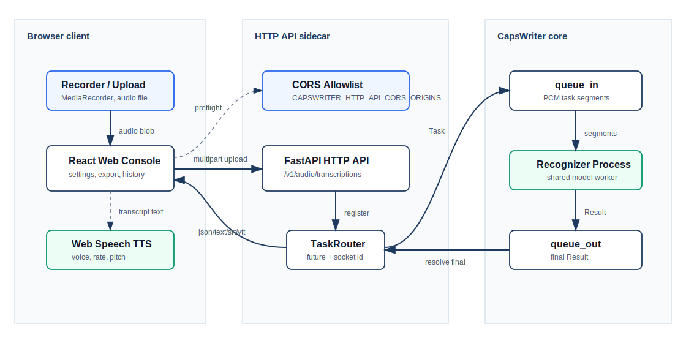

# Web Console

CapsWriter Web Console 是獨立於上游桌面 client 的瀏覽器工作台，位於 [`client/web`](../client/web)。它透過本 fork 的 OpenAI-compatible HTTP API 進行 STT，並使用瀏覽器 Web Speech API 做 TTS 播放。Linux、Windows 與其他桌面系統只要有現代瀏覽器，就能使用同一套語音轉錄與播放介面。



## 功能範圍

| 類別 | 功能 |
|---|---|
| STT | 麥克風錄音、音訊檔上傳、音訊預覽播放、OpenAI Whisper-compatible 轉錄 |
| 格式 | `json`、`text`、`verbose_json`、`srt`、`vtt` |
| TTS | 瀏覽器語音播放、voice 選擇、速度與音高調整、暫停/繼續/停止 |
| 工作流 | API health check、model list、Bearer token、language hint、prompt 欄位 |
| 留存 | localStorage 歷史、複製、下載匯出 |
| 隔離 | 前端依賴只在 `client/web/node_modules`，build/cache 可用 `npm run clean` 清理 |

## Server 設定

Web Console 從瀏覽器直接呼叫 HTTP API，因此 server 必須啟用 HTTP API，並允許前端 dev origin。

`.env`：

```bash
CAPSWRITER_HTTP_API_ENABLE=true
CAPSWRITER_HTTP_API_BIND=0.0.0.0
CAPSWRITER_HTTP_API_PORT=6017
CAPSWRITER_HTTP_API_KEY=sk-local-dev
CAPSWRITER_HTTP_API_CORS_ORIGINS=http://localhost:5173,http://127.0.0.1:5173
```

Docker Compose 需要同時開 port：

```yaml
ports:
  - "6016:6016"
  - "6017:6017"
```

啟動：

```bash
docker compose up -d --force-recreate capswriter-server
python check_http_api.py --host 127.0.0.1 --port 6017 --key sk-local-dev
```

## Frontend 開發

所有命令都在 `client/web` 內執行，不需要全域安裝套件。

```bash
cd client/web
npm install
npm run dev
```

開啟 Vite 顯示的本機 URL，預設是 `http://127.0.0.1:5173`。介面中的 `API root` 填 `http://127.0.0.1:6017`，`API key` 填 `.env` 的 `CAPSWRITER_HTTP_API_KEY`。

若只要在沒有模型的隔離環境測試前端流程，可另開一個 shell：

```bash
cd client/web
npm run mock-api
```

Mock API 會在 `http://127.0.0.1:6017` 提供 `/health`、`/v1/models`、`/v1/audio/transcriptions`。它只回傳固定文字，用來測 UI、CORS、multipart upload、格式解析與匯出；真實 STT 驗證仍需使用 CapsWriter server。

## Production build

```bash
cd client/web
npm run build
npm run preview
```

build 產物在 `client/web/dist`，不提交到 Git。若要完成一次乾淨驗證：

```bash
npm run verify
```

`verify` 會依序執行單元測試、production build 與清理腳本；即使 build 失敗也會嘗試清理已產生的暫存輸出。

## 清理策略

```bash
cd client/web
npm run clean
```

清理項目：

| 路徑 | 說明 |
|---|---|
| `dist` | production build 輸出 |
| `coverage` | 測試覆蓋率輸出 |
| `.vite` / `node_modules/.vite` | Vite cache |
| `playwright-report` / `test-results` | 瀏覽器測試輸出 |
| `.tmp` | 臨時檔 |

`node_modules` 是隔離依賴目錄，預設不由 `clean` 移除，避免每次驗證都重新下載。若要完全還原前端環境，可刪除 `client/web/node_modules` 後重新 `npm install`。

## 驗證清單

| 項目 | 命令或動作 | 預期 |
|---|---|---|
| 依賴安全 | `npm install` | `found 0 vulnerabilities` |
| 單元測試 | `npm run test` | API parsing 與 App render 測試通過 |
| Production build | `npm run build` | Vite 輸出 `dist` |
| 清理 | `npm run clean` | build/cache/test artifacts 被移除 |
| Server 語法 | `python -m compileall fork_server check_http_api.py start_server_docker.py` | 無 syntax error |
| 真實 STT | 上傳 wav/mp3 後按「轉錄」 | 回傳文字與格式化輸出 |
| 真實 TTS | 在 TTS 面板按「播放」 | 瀏覽器播放語音 |

## 架構邊界

- Web Console 不修改上游 `start_client.py` 或桌面 client 行為。
- STT 只透過 `POST /v1/audio/transcriptions` 呼叫 server。
- TTS 目前是 browser-local Web Speech API；不把音訊傳到雲端。
- localStorage 只保存使用者設定與最近 20 筆轉錄歷史。
- 若 server 有設定 API key，前端只使用 Bearer token header，不使用 cookie。

## 常見問題

**瀏覽器顯示 CORS error**

確認 `CAPSWRITER_HTTP_API_CORS_ORIGINS` 包含目前頁面的 origin，例如 `http://127.0.0.1:5173`。`localhost` 與 `127.0.0.1` 是不同 origin，需要同時列出。

**麥克風無法啟動**

確認瀏覽器權限、系統麥克風權限，以及頁面使用 `http://localhost` / `http://127.0.0.1` / HTTPS。一般 HTTP 遠端頁面不能使用 `getUserMedia`。

**TTS 沒有聲音**

Web Speech API 依賴作業系統與瀏覽器提供 voice。先確認系統音量、瀏覽器 voice 清單，以及瀏覽器是否允許頁面播放音訊。

**上傳後 500 並提到 ffmpeg**

server 需要 ffmpeg 解碼非 raw PCM 音訊。Docker image 已包含相關路徑；裸機模式需自行安裝 ffmpeg。
