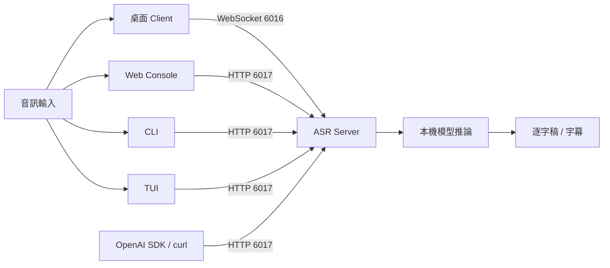

# Server 與 Client 分工

> [文件首頁](README.md) · [English](../en/server-and-clients.md) · [開始使用](getting-started.md)

CapsWriter 是 client/server 應用程式。**Server** 執行語音辨識；**Client** 收集
音訊並呈現結果。安裝 Client 不會安裝或複製一份辨識模型。

## 只要記住這個規則

1. 依需要的 model／hardware profile 啟動一個 Server。
2. 等 Server ready。
3. 連接任意數量的相容 Client。



## Server 負責什麼

只有 Server 會：

- 載入 Qwen ASR、Fun-ASR、SenseVoice 或其他 configured recognition model；
- 依設定下載／準備 model 與 native runtime asset；
- 呼叫 FFmpeg 並把音訊轉成推論需要的格式；
- 套用 server hotword 與 recognition setting；
- 排程 worker、限制 request／queue 並回傳逐字稿；
- 回報 process health 與 model／runtime readiness；
- 提供 WebSocket，以及明確啟用後的 HTTP interface。

### Server 選擇

| Server | 執行位置 | 常用入口 | 適用情境 |
|---|---|---|---|
| Windows package | Windows x86-64 | `start_server.exe` | 本機桌面語音輸入或 Windows ASR 主機 |
| Native source | Windows 或 Linux | `python start_server_universal.py` | 開發、除錯、客製安裝、Linux X11 desktop |
| Linux container | Linux `amd64` | `docker compose up -d capswriter-server` | Headless、NAS、工作站或共享服務 |

除非刻意隔離 port、model 與 log path，否則不要同時啟動多個 Server。

## Server interface

| Interface | 位址 | 預設 | 使用者 |
|---|---|---:|---|
| WebSocket | `ws://127.0.0.1:6016` | 開啟 | 原有桌面 Client |
| OpenAI 相容 HTTP | `http://127.0.0.1:6017` | 關閉 | Web、CLI、TUI、SDK、curl |
| HTTP liveness | `GET /health` | HTTP 啟用時 | 只表示 process 存活 |
| HTTP readiness | `GET /ready` | HTTP 啟用時 | Model、router、FFmpeg 與 limit readiness |

`/health` 不能取代 `/ready`。Process 可以存活，但 model 仍在下載或載入。

## 各 Client 負責什麼

Client 不會執行 Server 的 ASR model；本機功能如下：

| Client | 輸入與操作 | 連線 | Client 本機功能 | 不包含 |
|---|---|---|---|---|
| Windows／Linux X11 desktop | 麥克風、檔案、tray、全域快捷鍵 | WebSocket `6016` | 剪貼簿／文字注入 | 一般流程不需要 HTTP API |
| Web Console | Browser 錄音或檔案 upload | HTTP `6017` | Browser history／download 與 browser／OS TTS | 沒有 model、FFmpeg worker、tray、global hotkey |
| CLI | 檔案或 batch path | HTTP `6017` | Atomic file 與選用 OS TTS | 沒有麥克風、tray、global hotkey |
| Textual TUI | 檔案與選用 native 麥克風 | HTTP `6017` | 鍵盤 workflow 與 atomic save | 沒有 TTS、tray、global hotkey |
| OpenAI SDK／curl | 檔案 upload | HTTP `6017/v1` | Integration 自己的處理 | 沒有 bundled UI |

Web／CLI 的 TTS 在 Client 本機執行，不代表 ASR Server 提供 TTS endpoint。

## 支援的組合

### 個人 Windows desktop

```text
start_server.exe  --WebSocket :6016-->  start_client.exe
```

先啟動 Server、等待 model load，再啟動 desktop Client。HTTP API 是選用功能，
可以維持關閉。

### Linux X11 desktop

```text
start_server_universal.py  --WebSocket :6016-->  start_client.py
```

兩個 process 都在已登入的 X11 environment 中執行。Wayland／headless global
hotkey 不支援；請改用 file、Web、CLI 或 TUI Client。

### Headless Server + browser／terminal Client

```text
Docker Server --HTTP :6017--> Web / CLI / TUI / SDK
```

啟用 HTTP API 與 authentication、發布 `6017`，再連接一個或多個 Client。
Web Console 的 `8080` 只提供 static UI；browser 仍會呼叫 `6017` 的 Server。

### 共享或遠端 Server

Server 應放在 private network 或 maintained TLS reverse proxy 後方。使用 Bearer
key／key file、為 Web 設 explicit CORS allowlist，且只發布必要 port。WebSocket
`6016` 不是 authenticated public API。

## 正確啟動順序

1. 選擇並設定 Server model／hardware path。
2. 啟動 Server。
3. Desktop 路徑確認 `6016` WebSocket listener，再啟動 desktop Client。
4. Web／CLI／TUI／SDK 路徑啟用 HTTP、設定 authentication、發布 `6017`，並要求
   `/health` 與 `/ready` 都成功。
5. 送出一個內容已知的小型音訊，確認結果符合預期。
6. 第一條路徑成功後，再加入其他 Client。

## 常見錯誤

- **只啟動 Client：**背後沒有 model；請先啟動 Server。
- **把 Web／CLI／TUI 指向 6016：**它們需要 HTTP port 6017。
- **為 desktop Client 啟用 HTTP：**除非另有 HTTP consumer，否則不需要。
- **把 Web container 當 ASR Server：**它只提供 static file。
- **只檢查 `/health`：**upload 音訊前必須檢查 `/ready`。
- **把 TTS 當成 Server 功能：**Web／CLI 使用本機 browser／OS voice。
- **只複製 Windows package 裡的一個 EXE：**兩個 EXE、models、configuration 與
  runtime library 都要保留 release layout。

## 依元件繼續閱讀

### Server 與 API

- [部署](deployment.md)
- [OpenAI 相容 API](openai-api.md)
- [支援與安全](support-security.md)
- [疑難排解](troubleshooting.md)

### Clients

- [桌面可攜性](desktop-portability.md)
- [Web Console](web-console.md)
- [無 GUI CLI](cli-client.md)
- [Textual TUI](tui.md)
