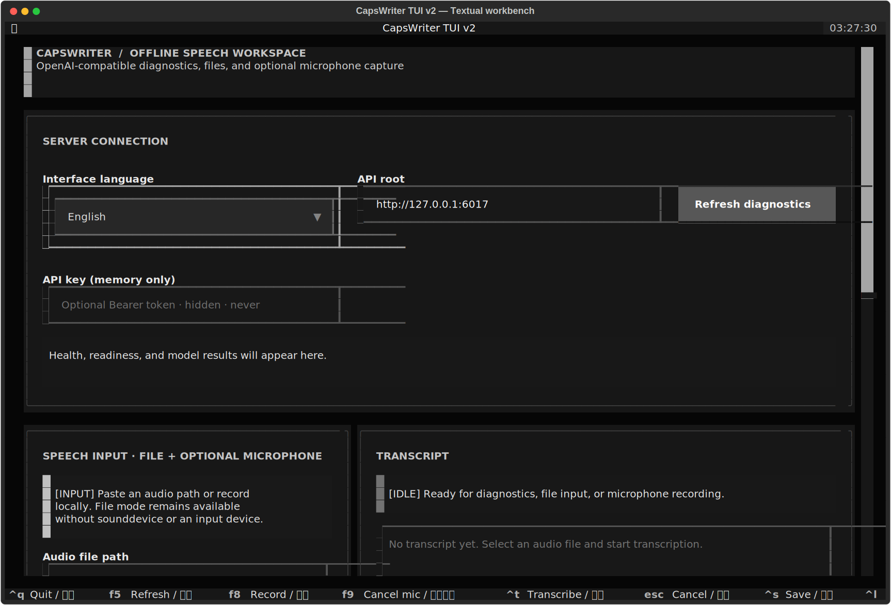

# CapsWriter TUI v2

> 繁體中文 · [English](../en/tui.md)

CapsWriter TUI 是 fork v2 本機 OpenAI 相容轉錄 API 的鍵盤優先 client。它可在
Windows 與 Linux terminal 執行；工作前先分別檢查 server、readiness 與 model，
接著轉錄既有音訊檔，也可選擇把麥克風錄成私有暫存 WAV，最後以原子操作儲存
文字或字幕。

這是 source checkout 內的 client，不取代上游 Windows 桌面語音輸入流程。音訊
只會送往你設定的 API 根網址；若要全程離線，請把它指向自己的 CapsWriter
server。



這張 SVG 並非繪製的 mockup。它把真實 `CapsWriterTui` 以 Textual Pilot 在
140×46 terminal cell 的 headless 環境掛載，再使用 Textual SVG renderer 匯出。
為了讓初始狀態可重現，擷取時使用 file-only mode，不會開啟麥克風。

文字等價說明：深色高對比 terminal 工作台上方是 API 根網址、遮罩且只存於
記憶體的 key，以及 health／readiness／model 診斷；下方並列檔案與選用麥克風
工作區、轉錄內容與狀態面板。footer 持續顯示主要快捷鍵。

## 支援邊界

| 項目 | 支援行為 |
|---|---|
| 作業系統 | Windows 與 Linux 的現代 terminal |
| Python | Lock 支援 3.10 到 3.12；CI 在 3.10 與 3.12 各跑完整 suite |
| API | CapsWriter fork v2 的 `health`、`ready`、`models` 與 `audio/transcriptions` routes |
| 輸入 | 既有本機檔案；選用 16 kHz mono 麥克風錄音 |
| 格式 | `text`、`json`、`verbose_json`、`srt`、`vtt` |
| 介面語言 | English 與繁體中文（`zh-Hant`） |
| Secret | 選用 Bearer token；會遮罩且只留在記憶體 |

實際可解碼的音訊 container 仍由 server 上的 ffmpeg 決定。TUI 安裝成功不表示
model 已載入，也不證明某種 codec 可用；F5 診斷會把這些狀態分開呈現。

## 從 hash lock 安裝

請在 repository 根目錄操作，並使用專屬 virtual environment，避免 user site 或
global package 意外滿足 release gate。

支援的 Linux shell：

```bash
python3.12 -m venv .venv-tui
.venv-tui/bin/python -m pip install \
  --disable-pip-version-check \
  --require-hashes \
  --only-binary=:all: \
  --requirement requirements-tui.lock
.venv-tui/bin/python -m client.tui --help
```

Windows PowerShell：

```powershell
py -3.12 -m venv .venv-tui
& .\.venv-tui\Scripts\python.exe -m pip install `
  --disable-pip-version-check `
  --require-hashes `
  --only-binary=:all: `
  --requirement requirements-tui.lock
& .\.venv-tui\Scripts\python.exe -m client.tui --help
```

Python 3.10 讀取同一份 lock，會依 marker 安裝 `exceptiongroup` backport；Python
3.12 則略過它。[`requirements-tui.txt`](../../requirements-tui.txt) 只列已審查的
direct exact pin；[`requirements-tui.lock`](../../requirements-tui.lock) 則解析所有
core transitive dependency 與 SHA-256 hash。Core lock 刻意不要求 native audio
stack，因此沒有麥克風也能使用 file-only mode。

### 選用麥克風

麥克風錄音是 progressive enhancement。相同 virtual environment 內必須有相容
的 `sounddevice`，OS 也要有可用的 PortAudio input device。這些 platform-specific
native 元件不在 core hash lock 內；缺少或載入失敗時，TUI 會顯示 **僅檔案模式**，
既有檔案的轉錄功能仍完整可用。

受管部署應針對目標 OS 另行 pin、稽核 `sounddevice`，並透過該 OS 的 package
機制配置 PortAudio。TUI 不會在 runtime 下載麥克風 driver。

## 啟用並連線到 server

HTTP API 預設關閉。請依 [OpenAI 相容 API 指南](openai-api.md)設定本機 server。
最小 loopback deployment 如下：

```dotenv
CAPSWRITER_HTTP_API_ENABLE=true
CAPSWRITER_HTTP_API_BIND=127.0.0.1
CAPSWRITER_HTTP_API_PORT=6017
CAPSWRITER_HTTP_API_KEY=replace-with-a-long-random-token
```

啟動 server，並在開啟 client 前確認 readiness：

```bash
curl http://127.0.0.1:6017/health
curl http://127.0.0.1:6017/ready
```

Linux 啟動方式：

```bash
CAPSWRITER_HTTP_API_KEY=replace-with-a-long-random-token \
  .venv-tui/bin/python -m client.tui \
  --base-url http://127.0.0.1:6017 \
  --lang zh-Hant
```

PowerShell 啟動方式：

```powershell
$env:CAPSWRITER_HTTP_API_KEY = "replace-with-a-long-random-token"
& .\.venv-tui\Scripts\python.exe -m client.tui `
  --base-url http://127.0.0.1:6017 `
  --lang zh-Hant
```

`--base-url` 可使用 API root，也可帶尾端 `/v1`，client 會正規化後者。只接受
不含 embedded credential、query string 或 fragment 的 absolute HTTP(S) URL。
程式刻意不提供 `--api-key` CLI option，避免 token 進入 shell history 與 process
argument；也可在 app 啟動後貼進遮罩欄位。

## 操作流程


文字等價說明：先安裝已審查的 hash lock，設定 API 根網址與只存於記憶體的 key，
再按 F5。Health、readiness、model、認證或 limit 失敗時會回到修正迴圈；全部就緒
後，選擇檔案或選用麥克風，以 Ctrl+T 送出有界且可取消的 request，檢查 response，
最後按 Ctrl+S 原子儲存。取消或離開會關閉進行中的工作並清除 TUI 所管理的暫存
錄音。

1. 按 **F5**。`健康狀態`、`就緒狀態`、`模型` 會分開顯示，不會把「HTTP process
   還活著」誤當成「recognizer 已載入」。
2. 貼上存在的音訊 path，或按 **F8** 開始選用錄音。Model 欄位應保持
   `whisper-1`；它是 wire compatibility ID，真正的離線 engine 由 server 選擇。
3. 可填 language hint 與最多 2,048 字元的 prompt，再選 response format。
4. 按 **Ctrl+T**。Request 進行期間，UI 會停用互相衝突的 control；按 **Esc**
   可安全取消。
5. 檢查回傳內容。檔案轉錄成功後，TUI 會依格式建議可攜的同層 `.txt`、`.json`、
   `.srt` 或 `.vtt` 檔名。
6. 按 **Ctrl+S**。儲存時先在同目錄寫入 UTF-8 暫存檔、flush，再以原子操作取代
   destination。Client 拒絕覆寫來源音訊，也拒絕寫進私有錄音暫存目錄。

## 快捷鍵

| 按鍵 | 動作 |
|---|---|
| `F5` | 更新 health、readiness 與 model 診斷 |
| `F8` | 開始錄音；錄音中再按一次會停止並選取 WAV |
| `F9` | 取消麥克風錄音並刪除暫存 WAV |
| `Ctrl+T` | 開始轉錄檔案或剛錄好的音訊 |
| `Esc` | 取消進行中的 request 或錄音 |
| `Ctrl+S` | 原子儲存目前的轉錄內容 |
| `Ctrl+L` | 切換 English／繁體中文 |
| `Ctrl+O` | Focus 音訊 path 欄位 |
| `Ctrl+Q` | 離開並清除 TUI 管理的暫存音訊 |

寬度低於 100 cell 時，workspace 會改成 narrow stacked layout。80×24 terminal
仍可使用，但 100×30 以上更容易閱讀。所有主要動作都能用鍵盤到達，focus 有
清楚的 cyan border；狀態同時使用 `正常`、`功能受限`、`處理中`、`錯誤` 等文字，
不只依賴顏色。

## 上限、隱私與 cancellation

- 診斷 timeout 預設 10 秒；轉錄預設 600 秒。兩者皆為有限值，上限 900 秒。
- Response body 預設上限 16 MiB，最大 64 MiB。Client 會拒絕過大的 declared
  body，也會在 streamed body 實際超限時停止讀取。
- 麥克風預設最長 300 秒、callback buffer 2 MiB；CLI 上限分別為 1,800 秒與
  64 MiB。
- HTTP redirect 與 ambient proxy environment variable 都不會跟隨。只要流量
  離開 loopback，就應明確使用受信任的 HTTPS API root。
- TUI 不會寫入 API key；若 peer error 意外反射記憶體內的 key，畫面前會先
  redact。
- Recorder directory 會 best-effort 設成 `0700`，WAV 設成 `0600`。錄音成功
  上傳、取消、被新錄音取代或正常離開時，都會刪除 TUI 管理的 audio。Upload
  失敗時只為同一 session 的 retry 暫留 WAV，離開時仍會清理。

常用啟動上限：

```bash
.venv-tui/bin/python -m client.tui \
  --diagnostic-timeout 10 \
  --transcription-timeout 600 \
  --max-response-mb 16 \
  --max-recording-seconds 300 \
  --recording-buffer-mb 2
```

## 驗證與 screenshot provenance

Strict verifier 必須在依 lock 安裝的 environment 內執行：

```bash
PYTHONDONTWRITEBYTECODE=1 PYTHONNOUSERSITE=1 \
  .venv-tui/bin/python scripts/verify_tui.py
```

它會驗證 Python 支援範圍、direct pin 與 lock parity、已安裝版本、import 與
`pip check`，再 discover 完整 TUI unit／Pilot suite。找不到 test、dependency
mismatch、import failure、test failure、timeout，甚至只出現一個 skipped test，
command 都會失敗。CI 會在 Python 3.10 與 3.12 分別執行此 consumer。

只有 UI 刻意變更後才重建真實 app screenshot：

```bash
.venv-tui/bin/python client/tui/scripts/capture_screenshot.py \
  --output docs/assets/tui-workbench.svg \
  --lang en \
  --width 140 \
  --height 46
```

只清除 TUI 所擁有的 Python residue：

```bash
.venv-tui/bin/python client/tui/scripts/clean.py
.venv-tui/bin/python client/tui/scripts/clean.py --check
```

更新 dependency 時，先修改 direct exact pin，再使用 lock 開頭記錄的 command，
從 Python 3.10 重新產生 universal lock，最後跑兩個 interpreter gate。不可手動
修改 lock 內的 version 或 hash。

## 疑難排解

| 症狀 | 檢查項目 |
|---|---|
| Connection refused | 確認 API 已啟用、port 已發布，且 TUI API root 是 client 視角可到達的 host |
| `401` | 在 `CAPSWRITER_HTTP_API_KEY` 或遮罩欄位使用相同 server token；不可放進 URL |
| Health 正常但 readiness 功能受限 | 查看獨立 readiness detail，確認 model child liveness、router binding、dependency 與 ffmpeg |
| Health 正常但 models 失敗 | 檢查認證與 `/v1/models`；診斷一致前不要開始轉錄 |
| Request timeout | 先看 server queue／inference log；只有音訊長度與 hardware 確有需要時才提高有界 timeout |
| Response too large | 改用 `text`、`srt` 或 `vtt`，或在 64 MiB 上限內提高 `--max-response-mb` |
| **僅檔案模式** | 安裝並驗證選用 native 麥克風 stack，或直接使用既有 audio file |
| 儲存被拒絕 | 選擇不同於來源音訊、且位於私有 recorder directory 外的永久 path |
