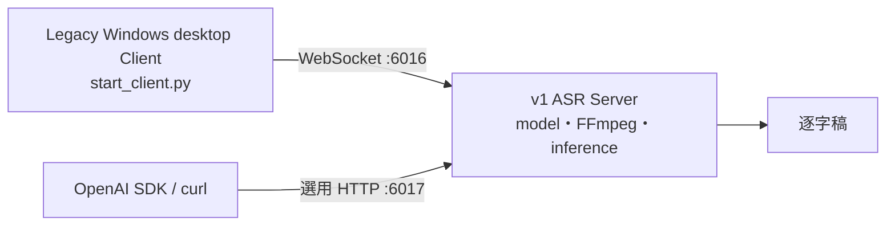

# CapsWriter-Offline fork v1 — Legacy Server + Desktop Client

> **v1 是隔離的 best-effort 維護線。**主要交付是 Linux/headless ASR Server；
> 同一份 source 保留 upstream 2.5-alpha 時期的 Windows desktop Client 相容性。
>
> 繁體中文 · [English](README.en.md)

[](LICENSE)
[](docs/zh-TW/maintenance.md)
[](docs/docker-server.md)

## 先理解 v1 的 Server／Client 分工



| 元件 | v1 內容 | 發行狀態 |
|---|---|---|
| **Server** | Linux bare-metal／Docker、WebSocket `6016`、選用 transcription-only HTTP `6017`、model bootstrap、GPU preference／CPU fallback | v1 的主要維護路徑；GitHub Release 提供 source，由使用者在本機 build |
| **Desktop Client** | Upstream-era `start_client.py`：Windows GUI、tray、hotkey、麥克風、剪貼簿／文字注入 | 只保留 source compatibility；沒有 v1 Windows EXE，除非 release 明確附上經真實 Windows 驗證的 artifact |
| **外部 API caller** | 相容 SDK／curl 可使用文件列出的 `whisper-1` transcription subset | API interface，不是本 repository 內附的 Client app |

**v1 不包含 v2 的 Web Console、no-GUI CLI、Textual TUI 或 universal Windows
package。**需要這些功能請使用 v2。

## Release 與 image 邊界

- v1 GitHub Release 是 **source-only pre-release**。
- Source archive 同時含 legacy Server/API/container code 與相容保留的 Windows
  desktop Client source。
- 目前不發布 v1 container image，也不附 Windows executable。
- `ghcr.io/df-wu/capswriter-offline-server:latest` 屬於 **v2**；v1 不可使用。
- v1 Compose 預設從目前 checkout build `capswriter-offline-v1-local:source`。

## 快速開始：v1 Linux Server

先決條件：Linux、Docker Engine、Compose plugin，以及 model 所需空間。NVIDIA
GPU 為選用；CPU fallback 可用。

```bash
cp .env.example .env
cp hot-server.example.txt hot-server.txt
docker compose build --pull capswriter-server
docker compose up -d capswriter-server
docker compose ps
docker compose logs -f capswriter-server
```

預設 WebSocket：

```text
ws://127.0.0.1:6016
```

Model、GPU／CPU、volume 與故障排查請見
[v1 Docker Server 指南](docs/docker-server.md)。

## 選用 OpenAI 相容 HTTP API

HTTP API 與 WebSocket Server 共用 recognizer，但預設關閉。它只實作文件列出的
檔案轉錄 subset，不支援 translation 或完整 OpenAI Audio API。

在 `.env` 啟用並設定 token：

```dotenv
CAPSWRITER_HTTP_API_ENABLE=true
CAPSWRITER_HTTP_API_BIND=127.0.0.1
CAPSWRITER_HTTP_API_PORT=6017
CAPSWRITER_HTTP_API_KEY=replace-with-a-long-random-token
```

取消 `docker-compose.yml` 內 HTTP `ports:` mapping 的註解後重建 Server。相容 SDK
caller 可以把 base URL 指向 `http://127.0.0.1:6017/v1`；unsupported field 可能
被拒絕，不能假設所有 OpenAI feature 都存在。

完整 contract、安全限制與 curl／SDK 範例見
[HTTP API reference](docs/HTTP_API.md)。

## Legacy Windows Desktop Client

v1 source 保留原始 desktop 流程：

```text
start_server.py  --WebSocket :6016-->  start_client.py
```

Desktop Client 負責 tray、hotkey、mic、clipboard 與 text injection；Server 才會載入
model 並推論。這不是 v2 universal package，也沒有隨目前 v1 Release 提供 EXE。

若自行建立 Windows artifact，發行前必須在真實 Windows 主機驗證 launch／exit、
tray、configured hotkey、microphone、clipboard、FFmpeg、model load、known audio 與
child-process cleanup。

## 支援範圍

| 路徑 | 狀態 | Automated evidence | 仍需實機驗證 |
|---|---|---|---|
| Linux Docker Server | 主要 legacy Server path | Ubuntu tests、Compose config、entrypoint shell、protocol／API units | Disposable image build、model download/load、中英文 known audio、GPU／CPU host |
| Linux bare-metal Server | Best effort | Python 3.10／3.12 server tests | FFmpeg、native library、model、service supervision |
| Windows desktop source | Compatibility-preserved | Windows Python 3.10／3.12 syntax／protocol tests | Tray、hotkey、mic、clipboard、PyInstaller artifact |
| Optional HTTP API | Legacy compatibility | Auth、upload bound、format、routing tests | Live authenticated model-backed transcription |
| macOS | 未列入 release qualification | 無完整 gate | 不做 project-level support claim |

CI 通過不等於 model quality、GPU backend、audio hardware 或 Windows desktop 已通過
release qualification。

## 維護與分支規則

- 開發 branch：`maintenance/v1`
- Standing comparison PR base：`archive/v1-legacy`
- 不可把 v1 merge 到 `master`，也不可把 v2 整體 backport 到 v1。
- 只接受重大 security、compatibility、model asset 與 contract 修正。
- v1 tag 使用 `fork-v1.<minor>.<patch>`；pre-release 可加 `-rc.<n>`。

詳細政策：

- [English maintenance policy](docs/en/maintenance.md)
- [繁體中文維護政策](docs/zh-TW/maintenance.md)

## 文件

| 文件 | 內容 |
|---|---|
| [v1 Docker Server](docs/docker-server.md) | Local source build、models、GPU／CPU、volume、ops |
| [HTTP API](docs/HTTP_API.md) | Transcription subset、auth、limits、SDK／curl |
| [v1 維護政策](docs/zh-TW/maintenance.md) | Branch、support、qualification、residual risk |
| [v1 Release notes](docs/zh-TW/release-notes.md) | RC 交付內容、Server／Client 邊界、剩餘 qualification |
| [Upstream changelog](docs/CHANGELOG.md) | Upstream-era product history |

## Upstream 與授權

此維護線來自
[HaujetZhao/CapsWriter-Offline](https://github.com/HaujetZhao/CapsWriter-Offline)
2.5-alpha 時期的 desktop／recognition code，並加入 fork 的 Linux Server、Docker
與 HTTP API 維護修正。新功能開發位於 fork v2。

License：[MIT](LICENSE)。
