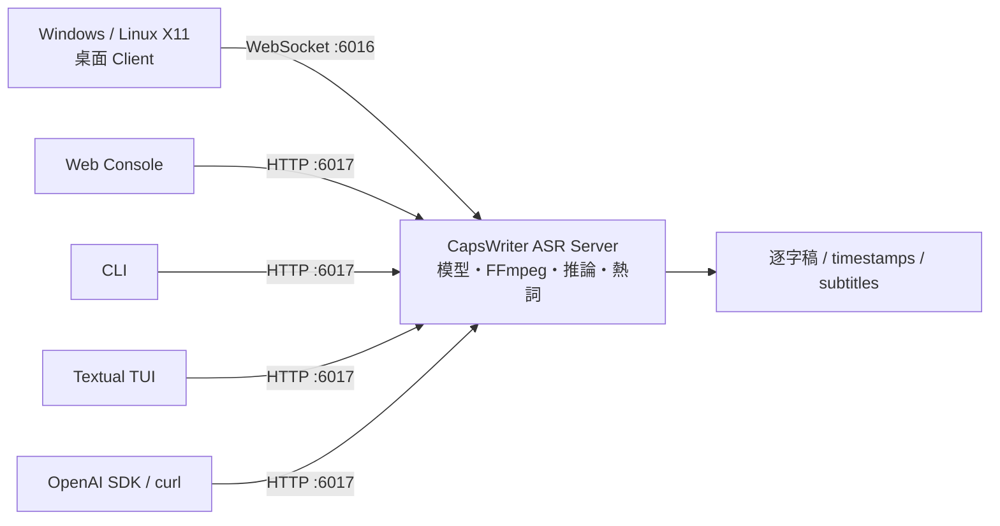

# CapsWriter-Offline — 本機 ASR Server + 多種 Client

> CapsWriter 在本機完成語音辨識。**Server 負責模型與推論；Client 負責收音、
> 操作介面與顯示結果。**先選 Server 的執行位置，再選一個或多個 Client。
>
> 繁體中文 · [English](README.en.md)

[](LICENSE)
[](docs/zh-TW/desktop-portability.md)
[](docker-compose.yml)
[](docs/zh-TW/openai-api.md)

本 fork 保留 upstream CapsWriter v2 的離線辨識模型、Windows 桌面操作方式與
WebSocket protocol，並新增 Linux container、選用 OpenAI 相容 HTTP API、Web、
CLI、TUI、Windows production package 與完整的跨平臺驗證。

## 先理解：Server 與 Client 是兩件事



| 元件 | 負責什麼 | 不負責什麼 |
|---|---|---|
| **Server** | 載入 ASR 模型、解碼音訊、套用熱詞、排程推論、產生逐字稿、提供健康狀態 | 不提供 browser／terminal UI，也不替使用者操作剪貼簿或全域快捷鍵 |
| **Client** | 錄音或選檔、送出音訊、顯示／儲存結果；桌面 client 另有 tray、快捷鍵與文字注入 | 不載入辨識模型，也不自行執行 ASR 推論 |

兩個 server interface 用途不同：

| Interface | 預設 | 使用者 |
|---|---:|---|
| WebSocket `ws://127.0.0.1:6016` | 開啟 | upstream Windows／Linux X11 桌面 client |
| OpenAI 相容 HTTP `http://127.0.0.1:6017` | **關閉，需明確啟用** | Web Console、CLI、TUI、OpenAI SDK、curl |
| Web Console `http://127.0.0.1:8080` | 選用 | 只提供網頁 UI；真正推論仍由 `:6017` 後方的 Server 執行 |

> **最常見的誤會：**Web、CLI、TUI 都不是另一套辨識 engine，它們必須連到已
> 啟用 HTTP API 的 CapsWriter Server。原有桌面 client 則直接使用 WebSocket，
> 一般情況不需要啟用 HTTP API。

完整的元件、protocol 與部署組合請先讀
[Server 與 Client 分工](docs/zh-TW/server-and-clients.md)。

## 第一步：選 Server

| Server 路徑 | 適合誰 | 啟動入口 | 支援邊界 |
|---|---|---|---|
| **Windows native／package** | 同一台 Windows 電腦上的桌面語音輸入，或 Windows ASR 主機 | `start_server.exe` 或 `python start_server_universal.py` | Production package 由 Windows CI 建置與雙 EXE self-check；真實 audio、tray、shortcut、model、hardware 仍需在目標主機驗證 |
| **Linux Docker（建議的 headless 路徑）** | NAS、工作站、伺服器、區網共享 ASR | `docker compose up -d capswriter-server` | 目前 release gate 為 `linux/amd64`；CPU 可用，GPU／iGPU 需對應 override 與實機驗證 |
| **Windows／Linux source** | 開發、除錯、客製 integration | `python start_server_universal.py` | 需自行安裝 server dependency、模型與 FFmpeg；Linux 桌面快捷鍵只支援 X11 |

Server 的完整安裝與維運請見[部署指南](docs/zh-TW/deployment.md)。

## 第二步：選 Client

| Client | 連線 | 主要用途 | 有沒有內建 ASR 模型？ |
|---|---|---|---:|
| **Windows／Linux X11 桌面 client** | WebSocket `:6016` | Tray、全域快捷鍵、麥克風、檔案轉錄、剪貼簿／文字注入 | 否 |
| **Web Console** | HTTP `:6017` | Browser 錄音、upload、五種格式、下載、本機 browser TTS | 否 |
| **無 GUI CLI** | HTTP `:6017` | Script、SSH、batch、atomic output、本機 OS TTS | 否 |
| **Textual TUI** | HTTP `:6017` | 鍵盤優先 diagnostics、檔案轉錄、選用麥克風、儲存 | 否 |
| **OpenAI SDK／curl** | HTTP `:6017/v1` | 把既有 integration 指向本機 transcription subset | 否 |


## 快速開始 A：Windows 桌面

Windows package 同時包含兩個程式，角色不可互換：

1. `start_server.exe`：載入模型並提供辨識服務。
2. `start_client.exe`：提供 tray、快捷鍵、錄音與文字輸入操作。

從 [GitHub Releases](https://github.com/DF-wu/CapsWriter-Offline-Container/releases)
下載有附 Windows ZIP 的 v2 release，完整解壓後先啟動 server，再啟動 client。
不要只複製其中一個 EXE；`models/`、runtime library 與設定檔也必須保持 release
內的相對位置。

建置、DirectML、X11 與實機驗證要求請見
[桌面可攜性](docs/zh-TW/desktop-portability.md)。

## 快速開始 B：Linux Docker Server + HTTP Client

### 1. 啟動 Server

先決條件：`linux/amd64`、Docker Engine、Compose plugin，以及足夠的 model／image
空間。GPU 為選用。

```bash
git clone https://github.com/DF-wu/CapsWriter-Offline-Container.git
cd CapsWriter-Offline-Container
cp .env.example .env
cp hot-server.example.txt hot-server.txt
docker compose up -d capswriter-server
docker compose ps
```

此時 WebSocket `:6016` 已可供 desktop client 使用。若要使用 Web、CLI、TUI 或
OpenAI SDK，請繼續啟用 HTTP API。

### 2. 啟用 HTTP API

在 `.env` 設定：

```dotenv
CAPSWRITER_HTTP_API_ENABLE=true
CAPSWRITER_HTTP_API_KEY=replace-with-a-long-random-token
CAPSWRITER_HTTP_API_PUBLISH_HOST=127.0.0.1
CAPSWRITER_HTTP_API_PORT=6017
```

再取消 [`docker-compose.yml`](docker-compose.yml) 內第二個 port mapping 的註解：

```yaml
ports:
  - "127.0.0.1:6016:6016"
  - "127.0.0.1:6017:6017"
```

重建並確認 **readiness**；`/health` 成功只表示 process 存活，`/ready` 才表示模型
與必要 runtime 已可接受音訊：

```bash
docker compose up -d --force-recreate capswriter-server
curl http://127.0.0.1:6017/health
curl http://127.0.0.1:6017/ready
```

非 loopback HTTP exposure 必須保留 authentication，並搭配 TLS reverse proxy 或
private overlay network。詳見[支援與安全](docs/zh-TW/support-security.md)。

### 3. 啟動一個 Client

Web Console：

```bash
docker compose -f docker-compose.web.yml up -d --build capswriter-web
```

CLI：

```bash
export CAPSWRITER_API_BASE=http://127.0.0.1:6017
export CAPSWRITER_HTTP_API_KEY_FILE=/path/to/capswriter-http.key
python client/cli/capswriter_cli.py ready
python client/cli/capswriter_cli.py transcribe meeting.wav --format text
```

TUI：

```bash
python3.12 -m venv .venv-tui
.venv-tui/bin/python -m pip install \
  --require-hashes --only-binary=:all: \
  --requirement requirements-tui.lock
.venv-tui/bin/python -m client.tui --base-url http://127.0.0.1:6017
```

請在 TUI 的 **API key（只存於記憶體）**遮罩欄位貼上 Server token；TUI 刻意不
提供 command-line key argument。

Web 開發模式必須使用 locked dependency tree：

```bash
cd client/web
npm ci --no-audit --no-fund
npm run dev
```

## Server 功能

- 本機 ASR 模型與 FFmpeg decode；不需要雲端推論服務。
- Model bootstrap、熱詞、持久化、GPU preference、CPU fallback 與 readiness。
- 原有 WebSocket protocol，以及選用 OpenAI 相容 `whisper-1` 檔案轉錄 subset。
- `text`、`json`、`verbose_json`、`srt`、`vtt` 五種 HTTP response format。
- Upload、decoded audio、queue、concurrency、deadline 與 response size bounds。
- Authentication、CORS allowlist、privacy-safe logging 與 OpenAI-style error envelope。

第一次 container 啟動可能下載模型與 runtime asset；下載完成後，辨識留在本機。

## Client 功能

- **Desktop：**最完整的本機語音輸入體驗；Windows 原生，Linux 僅支援 X11
  global hotkey，Wayland／headless 不支援 global hotkey。
- **Web：**免安裝 Python client；麥克風需 localhost／HTTPS secure context。
- **CLI：**最適合 automation、SSH、batch 與 shell pipeline。
- **TUI：**適合 terminal 內互動操作；file mode 為核心功能，麥克風需額外 native
  `sounddevice`／PortAudio stack。
- **SDK：**相容的是文件列出的 transcription subset；不包含 translation、streaming、
  diarization 或完整 OpenAI Audio API。

## 文件導覽

### 先讀

| 文件 | 回答的問題 |
|---|---|
| [Server 與 Client 分工](docs/zh-TW/server-and-clients.md) | 哪個元件做推論？每個 Client 連哪個 port？ |
| [開始使用](docs/zh-TW/getting-started.md) | 我應選 Windows desktop、Linux X11 還是 Docker？ |
| [文件首頁](docs/zh-TW/README.md) | 所有使用者、維運者與 contributor 文件入口 |

### Server／API

| 文件 | 內容 |
|---|---|
| [部署](docs/zh-TW/deployment.md) | Docker、Windows/source server、network、persistence、upgrade、rollback |
| [OpenAI 相容 API](docs/zh-TW/openai-api.md) | HTTP／SDK contract、auth、limits、errors |
| [支援與安全](docs/zh-TW/support-security.md) | Platform matrix、secret、privacy、supply chain |

### Clients

| 文件 | 內容 |
|---|---|
| [桌面可攜性](docs/zh-TW/desktop-portability.md) | Windows package、Linux X11、Wayland／headless 邊界 |
| [Web Console](docs/zh-TW/web-console.md) | Browser deployment、CORS、secure context |
| [CLI](docs/zh-TW/cli-client.md) | Script、batch、zipapp、output、TTS |
| [TUI](docs/zh-TW/tui.md) | 安裝、鍵盤操作、錄音、儲存、diagnostics |

### 維運／Release

| 文件 | 內容 |
|---|---|
| [疑難排解](docs/zh-TW/troubleshooting.md) | Desktop、container、API、Web、CLI、TUI 診斷順序 |
| [Release notes](docs/zh-TW/release-notes.md) | 變更、migration、限制、release evidence |
| [v1／v2 policy](docs/zh-TW/versioning.md) | 兩條維護線與 tag 規則 |
| [驗證](docs/verification.md) | CI、package、image、cleanup 與 manual evidence |

## 支援與 Release 證據

- Portable source 與 TUI 會在 Ubuntu 24.04／Windows 2022、Python 3.10／3.12 驗證。
- Windows production job 使用 hash lock 建置 PyInstaller package，將 ZIP 搬離
  checkout、解壓、拒絕 reparse point，並由 `start_server.exe` 與
  `start_client.exe` 各自執行 self-check。
- Server／Web image 以 immutable commit tag 發布，並附 SBOM／provenance；
  `latest` 只會 promotion 到當下通過 gate 的 `master` tip。
- 真實 model、known audio、microphone、tray、X11、GPU／DirectML 與目標 hardware
  仍需在宣稱對應 release 能力前驗證。

Fork v2 是 active line；fork v1 是隔離的 best-effort security／compatibility
maintenance line，兩者不可互相整體 merge。詳見[版本政策](docs/zh-TW/versioning.md)。

## Upstream 與授權

本 fork 基於
[HaujetZhao/CapsWriter-Offline](https://github.com/HaujetZhao/CapsWriter-Offline)，
持續沿用其模型、推論算法與 desktop product 工作；fork 新增的是 deployment、
portability、API、clients、安全邊界與 release pipeline。

License：[MIT](LICENSE)。
