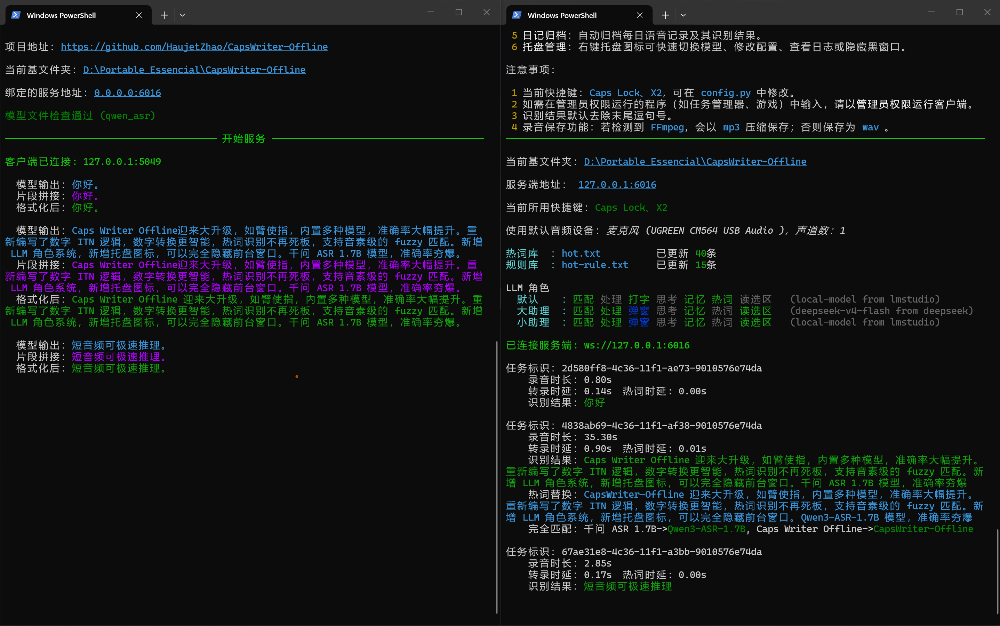

<div align="center">


# CapsWriter-Offline v2

**Hold CapsLock, speak, release — your words are typed. A fully offline voice input tool that can also run as a shared speech-to-text service on your NAS.**

English · [繁體中文](README.zh-TW.md)

[](https://github.com/DF-wu/CapsWriter-Offline-Container/releases)
[](LICENSE)
[](docs/en/desktop-portability.md)
[](docker-compose.yml)
[](docs/en/openai-api.md)

</div>


<sub>Diagrams and screenshots use the Traditional Chinese UI; every label is explained in the text.</sub>

## Contents

- [What it does](#what-it-does)
- [Two roles: Server and Client](#two-roles-server-and-client)
- [Which setup should I use?](#which-setup-should-i-use)
- [Quick start A: Windows desktop dictation](#quick-start-a-windows-desktop-dictation)
- [Quick start B: Linux Docker server](#quick-start-b-linux-docker-server)
- [Quick start C: Web, CLI, TUI and SDK clients](#quick-start-c-web-cli-tui-and-sdk-clients)
- [Everyday use](#everyday-use)
- [Choosing a model](#choosing-a-model)
- [Documentation map](#documentation-map)
- [FAQ](#faq)
- [Versions, upstream and license](#versions-upstream-and-license)

## What it does

| | Feature | Details |
|---|---|---|
| 🎙️ | **Dictation** | Hold CapsLock (or a mouse side button) in any text field, speak, release — the text is typed. A short press is still a normal CapsLock. |
| 🔒 | **Fully offline** | ASR, punctuation and number formatting run locally; audio never leaves your machine. LLM polishing is optional and can use local Ollama / LM Studio. |
| 📁 | **Files to subtitles** | Drop audio/video on the client to get `.srt`, `.txt`, `.json`; HTTP clients also get `.vtt`. |
| 🔥 | **Hotwords and rules** | `hot.txt` fixes names and jargon by phoneme similarity; `hot-rule.txt` applies regex replacements. |
| 🤖 | **LLM roles** | Start a sentence with a trigger word such as "translate" or "assistant" to translate, polish or answer. |
| 🐳 | **Docker server** | One command on Linux, models download automatically; CPU works, NVIDIA / Intel / AMD GPUs are optional. |
| 🔌 | **OpenAI-compatible API** | `POST /v1/audio/transcriptions` (`whisper-1`) — point an existing OpenAI SDK at a new base URL. |
| 🖥️ | **Many clients** | Windows / Linux X11 desktop, browser Web Console, no-GUI CLI, Textual TUI. |

<p align="center">
  
  <br><sub>Real Windows session (from upstream): server on the left, client on the right; short-phrase latency is about 0.1–0.2 s.</sub>
</p>

## Two roles: Server and Client

CapsWriter always consists of two cooperating programs:

| Component | Owns | Does not own |
|---|---|---|
| **Server** | Loads ASR models, decodes audio, applies server hotwords, schedules inference, produces transcripts/subtitles, reports health | No browser/terminal UI; never touches the user's clipboard or global shortcuts |
| **Client** | Records or picks files, sends audio, shows/saves results; the desktop client also owns tray, hotkeys and typing | Does not load models or run ASR inference |

The server exposes two interfaces for different clients:

| Interface | Default | Used by |
|---|---:|---|
| WebSocket `ws://127.0.0.1:6016` | On | Windows / Linux X11 desktop client |
| OpenAI-compatible HTTP `http://127.0.0.1:6017` | **Off; explicit opt-in** | Web Console, CLI, TUI, OpenAI SDK, curl |
| Web Console `http://127.0.0.1:8080` | Optional | UI only; inference still runs on the server behind `:6017` |

> [!TIP]
> Web, CLI and TUI are **not** separate recognition engines — they all need a
> CapsWriter server with the HTTP API enabled. The desktop client talks WebSocket
> and normally needs no HTTP API. See
> [Server and client roles](docs/en/server-and-clients.md).

## Which setup should I use?

| I want to… | Server runs on | Client | Start here |
|---|---|---|---|
| Dictate on my own Windows PC | The same PC (`start_server.exe`) | Desktop client (`start_client.exe`) | [Quick start A](#quick-start-a-windows-desktop-dictation) |
| Share one Linux box / NAS with several computers | Linux Docker | Desktop clients, Web, CLI | [Quick start B](#quick-start-b-linux-docker-server) → [C](#quick-start-c-web-cli-tui-and-sdk-clients) |
| Record or upload in a browser | Any server with HTTP enabled | Web Console | [Quick start C](#quick-start-c-web-cli-tui-and-sdk-clients) |
| Batch-transcribe from scripts / SSH / CI | Any server with HTTP enabled | CLI | [CLI guide](docs/en/cli-client.md) |
| Move existing OpenAI Whisper code on-prem | Any server with HTTP enabled | OpenAI SDK / curl | [API guide](docs/en/openai-api.md) |
| Dictate on a Linux desktop | The same Linux machine (source) | Linux X11 desktop client | [Getting started: Linux X11](docs/en/getting-started.md) |

## Quick start A: Windows desktop dictation

### 1. Download and extract

Download `CapsWriter-Offline-windows-x86_64.zip` from
[GitHub Releases](https://github.com/DF-wu/CapsWriter-Offline-Container/releases) and
extract the **whole folder** to a normal path such as `D:\CapsWriter-Offline`. Verify
it with the attached `SHA256SUMS` if you like.

It contains two programs with different jobs — never move one EXE out on its own:

```text
CapsWriter-Offline/
├─ start_server.exe      ← Server: loads the model, recognizes speech
├─ start_client.exe      ← Client: tray, hotkeys, recording, typing
├─ config_server.py      ← advanced server settings (model, ports…)
├─ config_client.py      ← advanced client settings (hotkeys, hotwords, LLM…)
├─ hot.txt / hot-rule.txt / hot-server.txt
├─ LLM/                  ← LLM roles
└─ models/               ← put models here (empty in the ZIP)
```

### 2. Add the model and GGUF runtime

To keep the download small, the ZIP does **not** include models, llama.cpp DLLs or
FFmpeg. The default Qwen3-ASR model needs two SHA-256-pinned downloads:

| Download | Extract to |
|---|---|
| [`Qwen3-ASR-1.7B-q5_k.zip`](https://github.com/HaujetZhao/CapsWriter-Offline/releases/download/models/Qwen3-ASR-1.7B-q5_k.zip) (~1.8 GB) | `models/Qwen3-ASR/`, giving `models/Qwen3-ASR/Qwen3-ASR-1.7B/` |
| [`llama-b7798-bin-win-vulkan-x64.zip`](https://github.com/ggml-org/llama.cpp/releases/download/b7798/llama-b7798-bin-win-vulkan-x64.zip) | copy its `*.dll` files into `core/server/engines/llama/bin/` |

The [desktop portability guide](docs/en/desktop-portability.md#prepare-a-downloaded-windows-package)
has a PowerShell block that downloads, verifies and places both for you. For file
transcription, add a trusted `ffmpeg.exe` (and `ffprobe.exe`) to `PATH` or the
package root; microphone dictation does not need it.

### 3. Start the server, then the client

1. Double-click `start_server.exe` and wait until the model has loaded ("开始服务").
2. Double-click `start_client.exe`; the CapsWriter icon appears in the tray.

On first use, or whenever you want to change something, run
`start_client.exe --settings` or choose **設定 (Settings)** from the tray menu:

<table>
  <tr>
    <td width="50%"></td>
    <td width="50%"></td>
  </tr>
  <tr>
    <td><b>Connection</b>: use <code>127.0.0.1</code> when the server is on this PC, otherwise its IP or hostname; click the connection test.</td>
    <td><b>Recording &amp; shortcuts</b>: choose a microphone, tune the hold time, add or disable keyboard / mouse shortcuts.</td>
  </tr>
</table>

<sub>Real rendering of the same Tk settings window on Linux (Xvfb); Windows uses its native theme and fonts.</sub>

Save and restart the client. Settings live in
`%LOCALAPPDATA%\CapsWriter\client-settings.json` and only store the fields you changed;
everything else comes from `config_client.py`. See [daily settings](docs/settings.md).

### 4. Talk


> [!NOTE]
> The release ZIP is built by the GitHub Actions `windows-package` job: a hash-locked
> PyInstaller build that is moved out of the checkout, zipped and re-extracted with
> reparse points rejected, then both EXEs pass `--artifact-self-check`. Please still
> confirm microphone, tray, hotkeys, model and GPU on your own PC. To build it
> yourself, see [BUILD_GUIDE](assets/BUILD_GUIDE.md).

## Quick start B: Linux Docker server

Requirements: `linux/amd64`, Docker Engine with the Compose plugin, and a few GB for models. GPUs are optional.

```bash
git clone https://github.com/DF-wu/CapsWriter-Offline-Container.git
cd CapsWriter-Offline-Container
cp .env.example .env
cp hot-server.example.txt hot-server.txt
docker compose up -d capswriter-server
docker compose logs -f capswriter-server   # the first start downloads the model
```

WebSocket `:6016` is now ready for desktop clients (enter this host's IP in their settings).

| For | Add this Compose file |
|---|---|
| NVIDIA GPU | `-f docker-compose.gpu.yml` |
| Intel / AMD iGPU (Vulkan) | `-f docker-compose.igpu.yml` |
| Lower-latency, smaller Fun-ASR-Nano model | `-f docker-compose.fun-asr.yml` |
| Managing `./models` yourself | `-f docker-compose.models-bind.yml` |
| Server settings in the Web UI | `-f docker-compose.settings.yml` (see [daily settings](docs/settings.md)) |

Example for NVIDIA: `docker compose -f docker-compose.yml -f docker-compose.gpu.yml up -d capswriter-server`.
Upgrades, backups and details are in the [deployment guide](docs/en/deployment.md).

### Enable the HTTP API (for Web / CLI / TUI / SDK)

Set in `.env`:

```dotenv
CAPSWRITER_HTTP_API_ENABLE=true
CAPSWRITER_HTTP_API_KEY=replace-with-a-long-random-token
CAPSWRITER_HTTP_API_PUBLISH_HOST=127.0.0.1
CAPSWRITER_HTTP_API_PORT=6017
CAPSWRITER_HTTP_API_CORS_ORIGINS=http://127.0.0.1:8080,http://localhost:8080,http://127.0.0.1:5173,http://localhost:5173
```

Then uncomment the second port mapping in [`docker-compose.yml`](docker-compose.yml):

```yaml
ports:
  - "127.0.0.1:6016:6016"
  - "127.0.0.1:6017:6017"
```

Recreate and check. `/health` only means the process is alive; `/ready` means the model can accept audio.

```bash
docker compose up -d --force-recreate capswriter-server
curl http://127.0.0.1:6017/health
curl http://127.0.0.1:6017/ready
```

> [!WARNING]
> When exposing HTTP beyond loopback, keep the API key and put the server behind a
> TLS reverse proxy or a private overlay network (e.g. Tailscale). See
> [support and security](docs/en/support-security.md).

## Quick start C: Web, CLI, TUI and SDK clients

These examples assume the HTTP API is at `http://127.0.0.1:6017` with the key
`replace-with-a-long-random-token`.

### Web Console: record or upload in a browser

```bash
CAPSWRITER_WEB_API_BASE=http://127.0.0.1:6017 \
  docker compose -f docker-compose.web.yml up -d --build capswriter-web
```

Open `http://127.0.0.1:8080`, confirm the API root `http://127.0.0.1:6017`, paste the
key into the masked field, then record or drop a file and download text/json/srt/vtt.


<sub>Real capture against a local Qwen3-ASR 1.7B (CPU) server transcribing a 5.6-second Chinese test clip.</sub>

Development mode for frontend work (Node.js 24):

```bash
cd client/web
npm ci --no-audit --no-fund
npm run dev      # open http://127.0.0.1:5173
```

### CLI: scripts and batches

Needs only the Python 3.10+ standard library:

```bash
export CAPSWRITER_API_BASE=http://127.0.0.1:6017
export CAPSWRITER_HTTP_API_KEY=replace-with-a-long-random-token
python client/cli/capswriter_cli.py ready
python client/cli/capswriter_cli.py transcribe meeting.wav --format text
python client/cli/capswriter_cli.py transcribe audio/*.mp3 --format srt --output-dir subs/
```


### TUI: a terminal workbench

```bash
python3.12 -m venv .venv-tui
.venv-tui/bin/python -m pip install \
  --require-hashes --only-binary=:all: \
  --requirement requirements/tui.lock
.venv-tui/bin/python -m client.tui --base-url http://127.0.0.1:6017
```

Paste the key into the memory-only API key field, press **F5** to check the server,
enter a file path, **Ctrl+T** to transcribe and **Ctrl+S** to save.


### OpenAI SDK

```python
from openai import OpenAI

client = OpenAI(base_url="http://127.0.0.1:6017/v1", api_key="replace-with-a-long-random-token")
with open("meeting.wav", "rb") as f:
    print(client.audio.transcriptions.create(model="whisper-1", file=f).text)
```

Formats: `text`, `json`, `verbose_json`, `srt`, `vtt`. Translation, streaming and
diarization are not supported. See the [OpenAI-compatible API](docs/en/openai-api.md).

## Everyday use

Full illustrated walkthrough: **[Usage guide](docs/en/usage.md)**. Highlights:

| I want to… | Do this |
|---|---|
| Dictate | Hold CapsLock or mouse X2, speak, release; a short press keeps its normal function |
| Turn a video into subtitles | Drop the file on `start_client.exe`; `.srt` / `.txt` / `.json` appear next to it |
| Fix subtitle typos | Edit the `.txt` and drop it back; a new `.srt` is aligned to the original timing |
| Get names right | Add one term per line to `hot.txt`; it reloads within ~3 s |
| Always replace something | Add `pattern = replacement` (regex) to `hot-rule.txt` |
| Translate by voice | Start with the role's trigger word, e.g. "翻译…" (configure `LLM/*.py` first) |
| Output Traditional Chinese | Settings → Output → convert to Traditional (`zh-tw` / `zh-hk` available) |
| Review what I said today | Tray → **日记 (Diary)**: daily Markdown with recordings |
| Stop LLM output | Press `Esc` |

Tray menu: **Settings**, copy result, diary, context, hotwords, clear memory, restart audio, restart, exit.

## Choosing a model

| Model (`model_type`) | Size | Notes | Docker auto-download |
|---|---:|---|:---:|
| **Qwen3-ASR 1.7B** (`qwen_asr`, default) | 1.3–1.8 GB | Most accurate, good with mixed Chinese/English; Vulkan/CUDA acceleration | ✅ |
| **Fun-ASR-Nano** (`fun_asr_nano`) | ~0.8 GB | Low latency, server hotwords, smooth on CPU | ✅ |
| SenseVoice (`sensevoice`) | ~0.4 GB | Light, multilingual (zh/en/ja/ko/yue) | manual |
| Paraformer (`paraformer`) | ~0.5 GB incl. punctuation | Light, Chinese | manual |

Docker selects with `CAPSWRITER_MODEL_TYPE`; Windows uses `model_type` in
`config_server.py`. Models come from the
[upstream model release](https://github.com/HaujetZhao/CapsWriter-Offline/releases/tag/models).

## Documentation map

| Reader | Documents |
|---|---|
| New users | [Server and client roles](docs/en/server-and-clients.md) → [Getting started](docs/en/getting-started.md) → [Usage guide](docs/en/usage.md) |
| Windows users | [Desktop portability](docs/en/desktop-portability.md) · [Daily settings](docs/settings.md) |
| Server operators | [Deployment](docs/en/deployment.md) · [Support and security](docs/en/support-security.md) · [Troubleshooting](docs/en/troubleshooting.md) |
| Clients | [Web Console](docs/en/web-console.md) · [CLI](docs/en/cli-client.md) · [TUI](docs/en/tui.md) · [OpenAI-compatible API](docs/en/openai-api.md) |
| Releases | [Release notes](docs/en/release-notes.md) · [v1/v2 policy](docs/en/versioning.md) · [Verification](docs/verification.md) |
| Developers | [Development](docs/development.md) · [Architecture](docs/architecture.md) · [Upstream sync](docs/upstream-sync-guide.md) · [Docs home](docs/en/README.md) |

Upstream's own guides for hotwords, LLM roles and file transcription are in
Simplified Chinese under [`docs/`](docs/).

## FAQ

<details>
<summary><b>Nothing happens when I hold CapsLock</b></summary>

Check that the server window shows the model loaded and the client window says it
connected ("已连接服务端"). To type into programs running as administrator (Task Manager,
some games) the client must also run as administrator. Logs: `logs/client_latest.log`
and `logs/server_latest.log`.
</details>

<details>
<summary><b>Docker stays in "starting"</b></summary>

The first start downloads 1–2 GB of models; the healthcheck allows 20 minutes. Follow
`docker compose logs -f capswriter-server`; with HTTP enabled, `/ready` lists what is
not ready yet. See [troubleshooting](docs/en/troubleshooting.md).
</details>

<details>
<summary><b>The Web Console reports CORS or 401</b></summary>

CORS: add the Web origin (e.g. `http://127.0.0.1:8080`) to
`CAPSWRITER_HTTP_API_CORS_ORIGINS` and recreate the server. 401: the key entered in the
Web UI must match the server's `CAPSWRITER_HTTP_API_KEY`.
</details>

<details>
<summary><b>Do hotkeys work on Linux?</b></summary>

On X11 only; Wayland and headless sessions have no reliable global hotkeys. X11 cannot
suppress a single key, so CapsLock will still toggle — F12 or a mouse side button works
better.
</details>

<details>
<summary><b>Do I need a GPU?</b></summary>

No. CPU works; Qwen3-ASR takes a few seconds per short phrase on CPU. For 0.1–0.3 s
latency add a GPU or use Fun-ASR-Nano.
</details>

## Versions, upstream and license

- **fork v2** (`master`) is the actively developed line, tagged `fork-v2.x.y`;
  **fork v1** is a separate security/compatibility maintenance line. See the
  [versioning policy](docs/en/versioning.md).
- Server and Web images are published to GHCR with immutable `sha-<commit>` tags plus
  SBOM/provenance; `latest` only follows a `master` commit that passed the gates.
- This fork is based on [HaujetZhao/CapsWriter-Offline](https://github.com/HaujetZhao/CapsWriter-Offline).
  Models, inference algorithms and the desktop experience come from upstream; the fork
  adds cross-platform deployment, the HTTP API, extra clients, safety limits and the
  release pipeline. If you like it, please support
  [the upstream author](https://github.com/HaujetZhao/CapsWriter-Offline) too.

License: [MIT](LICENSE).
